Introduction
============

Purchase Order Enhancements includes purchase order approvals, purchase order
commitments, and purchase order returns.

You can use purchase order approvals to maintain approval information for each
company. Purchase orders can be approved individually or in groups. Unapproved
purchase orders can’t be printed, received, or invoiced against.

Purchase order commitments tracks committed details against budgets and includes
the commitments in your financial reports. You can authorize purchases that
exceed budget amounts.

Purchase order returns processes purchasing returns and offsets the original
purchase order transaction amount against inventory accounts and applicable
general ledger accounts. Returned items are matched to the original receipts.
For more information, see the Purchase Order Processing documentation.

>   This introduction is divided into the following sections:

-   *What’s in this manual*

-   *Resources available from the Help menu*

-   *Send us your documentation comments*

### What’s in this manual

This manual is designed to give you an understanding of how to use the features
of Purchase Order Enhancements, and how it integrates with the Microsoft
Dynamics® GP system.

To make best use of Purchase Order Enhancements, you should be familiar with
systemwide features described in the System User’s Guide, the System Setup
Guide, and the System Administrator’s Guide.

Some features described in the documentation are optional and can be purchased
through your Microsoft Dynamics GP partner.

To view information about the release of Microsoft Dynamics GP that you’re using
and which modules or features you are registered to use, choose Help \>\> About
Microsoft Dynamics GP.

>   The manual is divided into the following parts:

-   *Part 1, Purchase order commitments*, includes information about setting up
    and using purchase order commitments.

-   *Part 2, Purchase order approvals*, includes information about setting up
    and using purchase order approvals.

### Resources available from the Help menu

>   The Microsoft Dynamics GP Help menu gives you access to user assistance
>   resources on your computer, as well as on the Web.

>   **Contents**

>   Opens the Help file for the active Microsoft Dynamics GP component, and
>   displays the main “contents” topic. To browse a more detailed table of
>   contents, click the Contents tab above the Help navigation pane. Items in
>   the contents topic and tab are arranged by module. If the contents for the
>   active component includes an “Additional Help files” topic, click the links
>   to view separate Help files that describe additional components.

>   To find information in Help by using the index or full-text search, click
>   the appropriate tab above the navigation pane, and type the keyword to find.

>   To save the link to a topic in the Help, select a topic and then select the
>   Favorites tab. Click Add.

>   **Index**

>   Opens the Help file for the active Microsoft Dynamics GP component, with the
>   Index tab active. To find information about a window that’s not currently
>   displayed, type the name of the window, and click Display.

**About this window**

Displays overview information about the current window. To view related topics
and descriptions of the fields, buttons, and menus for the window, choose the
appropriate link in the topic. You also can press F1 to display Help about the
current window.

**Lookup**

Opens a lookup window, if a window that you are viewing has a lookup window. For
example, if the Checkbook Maintenance window is open, you can choose this item
to open the Checkbooks lookup window.

**Show Required Fields**

Highlights fields that are required to have entries. Required fields must
contain information before you can save the record and close the window. You can
change the font color and style used to highlight required fields. On the
Microsoft Dynamics GP menu, choose User Preferences, and then choose Display.

**Printable Manuals**

Displays a list of manuals in Adobe Acrobat .pdf format, which you can print or
view.

**What’s New**

Provides information about enhancements that were added to Microsoft Dynamics GP
since the last major release.

#### Microsoft Dynamics GP Online

Opens a Web page that provides links to a variety of Web-based user assistance
resources. Access to some items requires registration for a paid support plan.

#### Customer Feedback Options

Provides information about how you can join the Customer Experience Improvement
Program to improve the quality, reliability, and performance of Microsoft®
software and services.

### Send us your documentation comments

We welcome comments regarding the usefulness of the Microsoft Dynamics GP
documentation. If you have specific suggestions or find any errors in this
manual, send your comments by e-mail to the following address:
*bizdoc\@microsoft.com*.

To send comments about specific topics from within Help, click the Documentation
Feedback link, which is located at the bottom of each Help topic.

*Note: By offering any suggestions to Microsoft, you give Microsoft full
permission to use them freely.*

Part 1: Purchase order commitments
==================================

This part of the documentation includes information about setting up and using
purchase order commitments. The following topics are discussed:

-   *Chapter 1, “Commitments transactions,”* describes how to set up purchase
    order commitments and track commitments.

-   *Chapter 2, “Commitments inquiries, reports, and maintenance,”* contains
    information about the reports, inquiries, and maintenance options available
    to you in purchase order commitments.

Chapter 1: Commitments transactions
-----------------------------------

>   Commitments are unreceived amounts from purchase order documents. These
>   amounts are committed to be paid at a later date, but are not yet received.
>   Purchase order commitments provides the capability to validate these amounts
>   against a budget and generate financial statements including these committed
>   expenditures.

>   This information is divided into the following sections:

-   *Setting up purchase order commitments*

-   *Entering purchase orders with commitments*

-   *Posting transactions with commitments*

-   *Editing the status of a purchase order*

-   *Authorizing multiple purchase orders*

-   *Authorizing and approving multiple purchase orders*

### Setting up purchase order commitments

>   Commitments are amounts from purchase order documents that are committed to
>   be paid at a later date, but are not yet invoiced. You can set up options
>   for commitments using the Purchase Order Commitments Setup window. You also
>   can select commitment tracking, approval, and password preferences.

>   **To set up purchase order commitments:**

1.  Open the PO Enhancements Setup window.

>   (Microsoft Dynamics GP menu \>\> Tools \>\> Setup \>\> Purchasing \>\>
>   Purchase Order Enhancements)

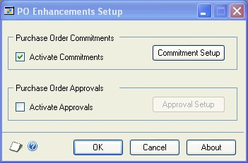

1.  Mark the Activate Commitments option. This option must be selected to use
    purchase order commitments.

>   If both purchase order commitments and purchase order approvals are
>   activated, all purchase orders with a status of New must be approved before
>   commitment can take place. If only purchase order commitments is activated,
>   all purchase orders with a status of New will automatically be committed.

>   *If the purchase order commitments is activated, fixed or variable
>   allocation accounts cannot be used in the Purchase Order Processing. The
>   system will not allow you to save transactions that use those accounts
>   because fixed and variable allocation accounts are not supported in this
>   release of purchase order commitments.*

>   If you mark Activate Commitments, the system will automatically reconcile
>   your existing data when you close the PO Enhancements Setup window.

1.  Choose Commitment Setup—the PO Commitments Setup window will open.

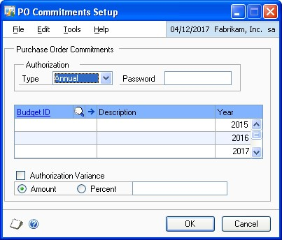

1.  Select one of the following authorization types:

>   **Annual** Authorization is based on the total budget and actual amount for
>   the year. If more than one budget is assigned to a fiscal year,
>   authorization is based on the combined total budgets and combined actual
>   amounts for the year.

>   **Period** Authorization is based on the budget and actual amounts for the
>   period that the purchase order’s required date is in.

>   **YTD** Authorization is based on the year-to-date budget and actual
>   balances based on the user date. If there is more than one budget assigned
>   to a fiscal year, the combined year-to-date budget and actual balances are
>   based on the user date.

>   If you want to use a password that will be required to allow
>   budget-exceeding purchases, enter a password.

1.  Enter a budget ID to identify the budget to compare commitments against.

>   *Budget ID Commityyyy is reserved for purchase order commitments (yyyy
>   represents a valid and open fiscal year, for example 2007 or 2008). If you
>   have a Budget ID named Commityyyy, copy this budget information to a new
>   Budget ID name and delete the Commityyyy Budget ID before activating
>   purchase order commitments. While using purchase order commitments, do not
>   set up a budget using the name Commityyyy.*

1.  To assign more than one budget to a fiscal year, select a fiscal year by
    clicking the Budget ID field for the corresponding year. Choose the Budget
    ID expansion button to open the Select Budgets window. Mark each budget that
    you want to assign to the selected fiscal year. Choose OK to return to the
    PO Commitments Setup window. If more than one budget is assigned to the
    fiscal year, \*Multiple appears in the Budget ID field.

>   To assign additional budgets to another fiscal year, repeat step 6. A budget
>   can be assigned to more than one year.

1.  If you choose to allow an authorization variance, mark the Authorization
    Variance option. An authorization variance is the amount a commitment can
    deviate from the available budget before requiring authorization.

2.  Select one of the following variance types and enter an acceptable budget
    variance value.

>   **Amount** A positive variance allows commitments to be over the available
>   budget by the entered dollar amount. A negative value requires commitments
>   to be under the available budget by the entered dollar amount.

>   **Percent** A positive variance allows commitments to be over the available
>   budget by the entered percent. A negative value requires commitments to be
>   under the available budget by the entered percent.

1.  Choose OK. The PO Commitments Setup window will close.

2.  Choose OK in the PO Enhancements Setup window. The following message will
    appear: “Changes have been made to PO Commitments Setup. Any active users
    must log in again to inherit these changes”.

>   If any existing purchase orders were not committed, the PO Exception Report
>   is automatically generated displaying the purchase orders not committed and
>   the reasons why.

>   In order to be committed, purchase orders must meet the following
>   requirements:

-   Each line item must have a valid account number.

-   Fixed or variable allocation accounts are not supported; line items using
    these accounts will not be committed.

-   The purchase order must have a Required Date.

-   The Required Date must fall in a valid and open fiscal period.

-   A valid Budget ID must be assigned to this fiscal period in the PO
    Commitments Setup window.

-   If purchase order approvals is activated, purchase orders with a status of
    New must be approved before commitment can take place.

>   *These requirements do not apply to the control line of Purchase Orders that
>   are entered as Blanket or Drop-Ship Blanket.*

1.  Review the list of rejected purchase orders on the PO Exception Report and
    make any necessary changes to those purchase orders.

>   *We recommend that you save and print the PO Exception Report now in case
>   you need to review this list and make further changes later.*

1.  If applicable, advise any active users to log off and log in again.

### Entering purchase orders with commitments

>   Use the Purchase Order Entry window to create and authorize commitments. As
>   you enter each item, purchase order commitments will validate the item
>   against the available budget.

>   *The Allow Sales Documents Commitments option in the Purchase Order Entry
>   window is used to commit purchase orders to sales documents. This is not
>   directly related to purchase order commitments. For more information about
>   the Allow Sales Documents Commitments option, please refer to the Purchase
>   Order Processing documentation.*

>   The following information applies to purchase order commitments:

-   Fixed and variable allocation accounts are not supported for purchase order
    commitments.

-   For purchase orders that are entered as Blanket or Drop-Ship Blanket, the
    control line amount is excluded from commitments and approval limits.

-   Purchase orders with unauthorized commitment amounts can be saved but cannot
    be printed. Also you cannot receive on unauthorized purchase orders.

-   For any unapproved purchase orders, all line amounts become uncommitted when
    you save the purchase order.

-   Purchase orders are not committed if the required date for a purchase order
    line item is in a fiscal period or a fiscal year that doesn’t have a budget
    assigned to the year in the PO Commitments Setup window.

>   **To enter purchase orders with commitments:**

1.  Open the Purchase Order Entry window.

>   (Transactions \>\> Purchasing \>\> Purchase Order Entry)

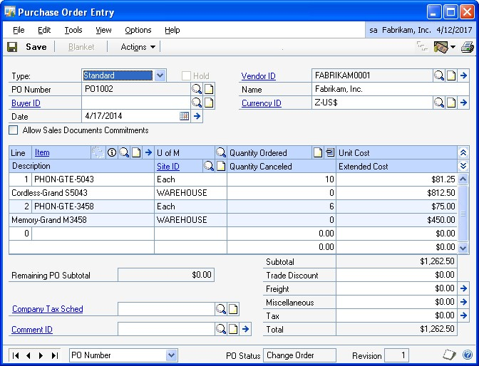

1.  Process the purchase order. For information about processing purchase
    orders, please refer to the Purchase Order Processing documentation.

>   If any line items exceed the available budget, an approval message will
>   appear. To authorize the purchase order, choose Yes. If you enabled
>   authorization passwords while setting up purchase order commitments, the
>   password entry window will appear.

>   As you add items to a purchase order, a calculation is performed to
>   determine if adding the item will result in an exceeded budget.

>   *The purchase order amount must be less than the amount calculated as:
>   (Total Budgeted Amount + Variance Allowance) – (Total Actual Amount + Total
>   Committed Amounts). In the calculation the total actual amount includes
>   posted and unposted transactions.*

>   For example, if an annual budget is set at \$10,000 and a purchase order is
>   created for \$2,000, the available budget is then \$8,000 — that is \$10,000
>   reduced by the \$2000 commitment. A new purchase order for \$8,500 would
>   exceed the budget and require authorization.

>   3. Choose Save. All unauthorized commitments will be validated against the
>   budget. If the commitment amount of an item is within the budget, the item
>   will be authorized. If the commitment amount of an item exceeds the budget,
>   an approval message will appear. To authorize the commitment amount for the
>   item, choose Yes. You must authorize all commitment amounts before posting
>   the purchase order.

### Posting transactions with commitments

>   When you receive a shipment of goods or an invoice, each item’s committed
>   amount will be reduced by the quantity received or by the item’s invoiced
>   amount. If the quantity received or the invoiced amount is greater than the
>   item’s committed amount, the committed amount will be reduced to zero.

>   It is recommended that you mark the Post Through General Ledger Files option
>   in the Posting Setup window before posting entries to update actual amounts.
>   To post through General Ledger, you must post in batches. Transaction level
>   posting will only post to General Ledger.

>   *When you save to a batch ID, commitments will not be updated until the
>   specific receivings transaction batch is posted.*

### Editing the status of a purchase order

>   Use the Edit Purchase Order Status window to change the status of a purchase
>   order. When you modify purchase orders, the commitment amounts will be
>   updated to reflect the changes.

-   To close the purchase order, select Closed from the Purchase Order Status
    list. The status of each line will be changed to Closed and the remaining
    commitment amount will be reduced to zero.

-   To cancel an item, select Canceled from the Status list. The commitment
    amount will be reduced by the amount canceled.

### Authorizing multiple purchase orders

>   If both purchase order commitments and purchase order approvals are
>   activated, you can authorize and approve multiple purchase orders at the
>   same time. See *Authorizing and approving multiple purchase orders* for more
>   information.

>   If only purchase order commitments is activated, the Purchase Order
>   Enhancements Entry window will display all unauthorized purchase orders. Use
>   the Purchase Order Enhancements Entry window to authorize multiple purchase
>   orders.

>   *If a purchase order line item’s required date is in a fiscal period or a
>   fiscal year that doesn’t have a budget assigned to the year in the PO
>   Commitments Setup window, the purchase order will not be displayed in the
>   Purchase Order Enhancements Entry window.*

>   **To authorize multiple purchase orders:**

1.  Open the Purchase Order Enhancements Entry window.

>   (Transactions \>\> Purchasing \>\> Purchase Order Enhancements Entry)

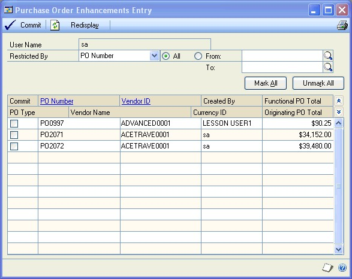

1.  Select your purchase order restriction preference.

>   **PO Number** Purchase orders will be restricted based on the specified
>   purchase order number range.

>   **Vendor ID** Purchase orders will be restricted based on the selected
>   Vendor ID range.

>   **Created By** Purchase orders will be restricted based on the specified
>   Created By range.

1.  Mark each purchase order you want to authorize in the Commit column or
    choose Mark All if you want to authorize every purchase order in the window.

>   If you mark an individual purchase order that is over budget, you will
>   receive a message asking if you would like to authorize this amount.

>   If you choose Mark All when any purchase orders are over budget, you will
>   receive a message asking if you would like to authorize all of the purchase
>   orders. If you choose Yes, all marked purchase orders will be authorized
>   including any that are over budget.

>   *You can print an edit list by choosing File \>\> Print or choosing the
>   Print button. An edit list outlines the changes that will take place if you
>   authorize the selected documents.*

1.  Choose Commit.

>   Close the Purchase Order Enhancements Entry window. You will have the option
>   to print the PO Commitments Audit Report.

### Authorizing and approving multiple purchase orders 

>   Both purchase order commitments and purchase order approvals must be
>   activated to authorize and approve multiple purchase orders at the same
>   time.

>   If both purchase order commitments and purchase order approvals are
>   activated, the Purchase Order Enhancements Entry window will display all
>   unauthorized and all unapproved purchase orders that the current user can
>   approve. When both purchase order commitments and purchase order approvals
>   are activated, use the Purchase Order Enhancements Entry window to authorize
>   and approve multiple purchase orders. All purchase orders must be authorized
>   before they can be approved.

>   *If a purchase order line item’s required date is in a fiscal period or a
>   fiscal year that doesn’t have a budget assigned to the year in the PO
>   Commitments Setup window, the purchase order will not be displayed in the
>   Purchase Order Enhancements Entry window.*

>   **To authorize and approve multiple purchase orders:**

1.  Open the Purchase Order Enhancements Entry window.

>   (Transactions \>\> Purchasing \>\> Purchase Order Enhancements Entry) *Only
>   subtotal amounts within your approval authority will display in this
>   window.*

1.  Select your purchase order restriction preference.

>   **PO Number** Purchase orders will be restricted based on the specified
>   purchase order number range.

>   **Vendor ID** Purchase orders will be restricted based on the selected
>   Vendor ID range.

>   **Created By** Purchase orders will be restricted based on the specified
>   Created By range.

1.  Mark each purchase order to authorize and approve in the Approve column or
    choose Mark All if you want to authorize and approve every purchase order in
    the window.

>   If you mark an individual purchase order that is over budget, you will
>   receive a message asking if you would like to authorize this amount.

>   If you choose Mark All when any purchase orders are over budget, you will
>   receive a message asking if you want to authorize all of the purchase
>   orders. If you choose Yes, all marked purchase orders will be authorized
>   including any that are over budget. All purchase orders must be authorized
>   before they can be approved.

>   *You can print an edit list by choosing File \>\> Print or choosing the
>   Print button. An edit list outlines the changes that will take place if you
>   authorize the selected documents.*

1.  Choose Approve (top left corner of screen).

>   *For purchase orders that are entered as Blanket or Drop-Ship Blanket, the
>   control line amount is excluded from commitments and approval limits. Trade
>   Discounts, Freight, Miscellaneous and Taxes also are excluded from the
>   approval calculation.*

1.  Close the Purchase Order Enhancements Entry window.

>   You will have the option to print the PO Approvals Audit Report showing
>   which purchase orders have been approved (and authorized).

Chapter 2: Commitments inquiries, reports, and maintenance
----------------------------------------------------------

>   Purchase order commitments is designed to track outstanding purchase orders
>   and maintain this data within a budget container (for example, COMMIT2007,
>   COMMIT2008) for each open fiscal year. In order to report on commitments,
>   you must include the COMMIT budget ID for the desired fiscal year within the
>   report. Purchase order commitments is available to any reports which can be
>   modified or created using any of the Microsoft Dynamics GP supported
>   reporting tools such as Report Writer, FRx®, Enterprise Reporting, and
>   Management Reporter.

>   This information is divided into the following sections:

###  • *Viewing budget vs. actual and committed information*

-   *Viewing committed detail information*

-   *Maintaining purchase order commitments data*

>   **Viewing budget vs. actual and committed information**

>   Use the Budget vs Actual and Committed Inquiry window to view the following
>   information:

-   Actual, committed, and budgeted amounts for a specified account and budget

-   Amount variances to compare actual and committed amounts

-   Percentage variances to compare actual and committed amounts

-   Purchase request line amounts that have received final approval, but haven’t
    been transferred to a purchase order, if you are using commitments in
    Business Portal Requisition Management

>   *For purchase orders that are entered as Blanket or Drop-Ship Blanket, the
>   control line amount is excluded from inquiries and reports.*

>   **To view budget vs. actual and committed information:**

1.  Open the Budget vs Actual & Committed Inquiry window.

>   (Inquiry \>\> Purchasing \>\> Budget vs Actual & Committed)

1.  Select to view information by budget or by year.

2.  Select an account.

3.  Enter or select a budget, if applicable.

4.  Select a year, if applicable. You must select a year if a budget overlaps
    more than one fiscal year.

5.  Select an inquiry to display.

>   **Net Change** The inquiry will display the total accumulated amounts for
>   the year.

>   **Period Balance** The inquiry will display the account balances for each
>   period.

1.  Choose Redisplay to update the inquiry results.

>   *The displayed amounts will not automatically update when changes are made
>   using other windows.*

1.  To print the Budget vs Actual & Committed report, choose File \>\> Print or
    click the Print button.

### Viewing committed detail information

>   Use the Committed Detail Inquiry window to view committed detail
>   information. No printed reports are available from this window.

>   *For Purchase Orders that are entered as Blanket or Drop-Ship Blanket, the
>   control line amount is excluded from inquiries and reports.*

>   **To view committed detail information:**

1.  Open the Committed Detail Inquiry window.

>   (Inquiry \>\> Purchasing \>\> Committed Detail)

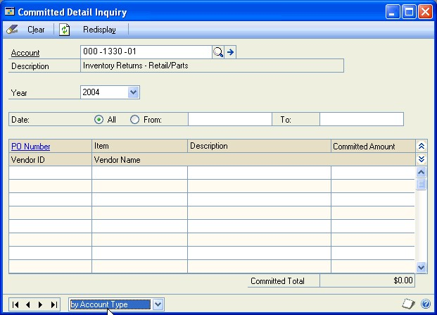

>   You also can open this window by clicking on the Committed heading link in
>   the Budget vs Actual & Committed Inquiry window.

1.  Select an account.

2.  Select a year. You must select an open fiscal year.

3.  Choose from the following date options to select the time period for the
    inquiry.

>   **All** The inquiry will include all periods in the specified year.

>   **From** The inquiry will include the range entered in the From and To
>   fields.

1.  To perform an inquiry on a specific purchase order, select the item and
    click the PO Number heading link. The Purchase Order Inquiry Zoom window
    will open.

2.  Choose Redisplay. The inquiry results will be updated.

### Maintaining purchase order commitments data

>   Occasionally, hardware failures, power surges, and other problems can damage
>   or destroy your data. To minimize the risk of data loss resulting from table
>   damage, back up your accounting data regularly. If approvals or commitments
>   data is damaged, you can use the PO Enhancements Maintenance window to
>   reconcile data in the purchase order commitments and purchase order
>   approvals tables.

>   **To maintain purchase order commitments data:**

1.  Create a backup copy of your data.

2.  Open the PO Enhancements Maintenance window.

>   (Microsoft Dynamics GP menu \>\> Maintenance \>\> Purchase Order
>   Enhancements)

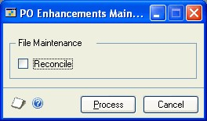

1.  Select Reconcile and then Process.

>   Reconcile compares data in the Purchase Order Approval (POA) or Purchase
>   Order Commitments (POC) tables (or both) to data in the Purchase Order
>   Processing (POP) table and identifies discrepancies.

>   Discrepancies are corrected by changing the POA or POC tables (or both) to
>   match the POP table. Lone, or orphan records, found in POA or POC tables are
>   removed. Approvals and authorizations are updated appropriately.

>   If you are using commitments in Business Portal Requisition Management, the
>   amounts for purchase request lines that have received final approval, but
>   that haven't been transferred to a purchase order will be committed.

>   A purchase request line will be removed and its amount will no longer be
>   committed in the following situations.

-   The line hasn't received final approval.

-   The line has been transferred to a purchase order.

-   The line has been voided.

-   The line isn't found in Requisition Management.

>   If the committed amounts for a purchase request line is different from the
>   purchase request line's extended price, the committed amounts will be
>   updated to reflect the line's extended price.

>   If the required date for the purchase order line items is in a fiscal period
>   or a fiscal year that doesn’t have a budget assigned to the year in the PO
>   Commitments Setup window, the purchase orders are not committed as part of
>   the reconcile process.

>   A PO Exception Report is automatically generated, listing all uncommitted
>   purchase orders and the reasons why they were not committed.

Part 2: Purchase order approvals
================================

>   This part of the documentation includes information about setting up and
>   using purchase order approvals. The following topics are discussed:

-   *Chapter 3, “Approvals transactions,”* describes how to set up purchase
    order approvals and approve purchase orders.

-   *Chapter 4, “Approvals inquiries, reports, and maintenance,”* contains
    information about the reports, inquiries, and maintenance options available
    to you in purchase order approvals.

Chapter 3: Approvals transactions
---------------------------------

>   You can use purchase order approvals to assign approval capabilities to each
>   of your users. Before you use purchase order approvals, you must set up
>   users, approval types, security types, and specify a report to use.

>   When a user attempts to approve a purchase order, validation will be
>   performed to ensure that the user is authorized to approve the purchase
>   order. Unapproved purchase orders can’t be received against, invoiced
>   against, or printed. You can place or remove holds for approved and
>   unapproved purchase orders.

>   This information is divided into the following sections:

-   *Setting up purchase order approvals*

-   *Deleting purchase order approvals users from the system*

-   *Entering and approving purchase orders*

-   *Approving multiple purchase orders*

-   *Authorizing and approving multiple purchase orders*

-   *Editing the status of purchase orders*

### Setting up purchase order approvals

>   Use the PO Enhancements Setup window to activate purchase order approvals.
>   The Purchase Order Approval User Setup window displays all the users who
>   have access to the current company. Use this window to assign approval
>   authority amounts, report to user IDs, and security types to users.

>   To use purchase order approvals, be sure that purchase order approval
>   workflow is not activated. You can’t use Purchase Order Approvals and the
>   purchase order approval workflow in Purchase Order Processing at the same
>   time.

>   **To set up purchase order approvals:**

1.  Open the PO Enhancements Setup window.

>   (Microsoft Dynamics GP menu \>\> Tools \>\> Setup \>\> Purchasing \>\>
>   Purchase Order Enhancements)

1.  Mark Activate Approvals under purchase order approvals in the lower part of
    the window. Select this option to use the features of Purchase Order
    Approvals.

>   If you mark Activate Approvals, the system will automatically reconcile your
>   existing data when you close the PO Enhancements Setup window.

1.  Choose Approval Setup. The Purchase Order Approval User Setup window will
    open and the Purchase Order Approvals module will be activated.

>   The window displays a list of all the users who have access to the company.

1.  Select a user.

2.  Select the Approval Type to set the maximum dollar amount that the user can
    approve.

-   If you mark Approval Authority Amount, the user will be able to approve
    purchase orders up to the amount you enter in the Approval Authority Amount
    field. This amount will be displayed in the functional currency of the
    current company—purchase order commitments verifies against the functional
    currency only.

-   If you mark Unlimited Approval Authority, the user will be able to approve
    any purchase order in the current company.

*We recommend that you grant Unlimited Approval Authority to at least one user.*

1.  If you want the current user to be required to report to another user for
    purchase order approvals, select a Report To User ID. This option will only
    be available if you selected Approval Authority Amount as the Approval Type
    for the user in step 5.

>   *You must choose a Report to User ID with either unlimited approval
>   authority or a greater approval amount than the current user.*

1.  Select a Security Type. The Security Type option will be available only when
    you select Approval Authority Amount as the Approval Type for the user.

    -   If you mark User can only approve POs for users that report to them, the
        user will be able to approve purchase orders only for users that report
        to him or her.

    -   If you mark User can approve POs for any user, up to approval authority,
        the user will be able to approve purchase orders for all users if the
        amount doesn’t exceed his or her approval authority amount.

2.  If you want to modify another user’s approval information, repeat steps 5
    through 8 you have modified approval information for all users. Your changes
    will be saved automatically.

3.  To print the Purchase Order Approvals Setup List, choose File \>\> Print.

4.  Choose OK. The Purchase Order Approval User Setup window will close.

5.  Choose OK in the PO Enhancements Setup window.

### Deleting purchase order approvals users from the system

>   If the user has access to one company only, you may delete the user from the
>   system in the User Setup window (Microsoft Dynamics GP menu \>\> Tools \>\>
>   Setup \>\> System \>\> User).

>   If the user has access to more than one company, you must remove the user’s
>   access from all companies first using the User Access Setup window
>   (Microsoft Dynamics GP menu \>\> Tools \>\> Setup \>\> System \>\> User
>   Access), then delete the user in the User Setup window. All of the Purchase
>   Order Approval setup information with respect to that user will be deleted.

### Entering and approving purchase orders

>   Enter purchase orders using the Purchase Order Entry window. Use the
>   Approvals Status field to approve purchase orders.

>   If you are using Encumbrance Management, you can specify how line items are
>   encumbered when purchase orders are approved. For more information, see the
>   Encumbrance Management documentation.

>   *If purchase order commitments is activated, the purchase order must be
>   authorized for commitments before you can approve it.*

>   **To enter and approve purchase orders:**

1.  Open the Purchase Order Entry window.

>   (Transactions \>\> Purchasing \>\> Purchase Order Entry)

1.  Create or select a purchase order. For information about creating purchase
    orders, please refer to the Purchase Order Processing documentation.

    -   If you create a new purchase order, the fields in the PO Approvals
        Detail Entry window will be blank and the default Approval Status will
        be Unapproved.

    -   If you select an existing purchase order, the PO Approvals Status field
        will display the approval status for the purchase order.

2.  Select a PO Approval Status for the purchase order.

>   When you approve a purchase order, your Approval Authority Amount will be
>   compared to the Remaining PO Subtotal amount. If the subtotal amount exceeds
>   your approval authority, the Approval Status will change to Unapproved and
>   the related approval information will be cleared. If the subtotal amount is
>   within your approval authority, the purchase order will be approved. For
>   information on setting a user’s Approval Authority Amount, please refer to
>   *Setting up purchase order approvals* on page 21.

>   *For Purchase Orders that are entered as Blanket or Drop-Ship Blanket, the
>   control line amount is excluded from commitments and approval limits. As
>   well, Trade Discounts, Freight, Miscellaneous and Taxes are excluded from
>   the approval calculation.*

1.  Choose Save.

>   *You cannot receive against, invoice against, or print unapproved purchase
>   orders. You can place or remove holds for approved and unapproved purchase
>   orders.*

1.  Close the Purchase Order Entry window. You will have the option to print the
    Purchase Order Approval Audit Report—a report which details all of the
    purchase orders you approved.

### Approving multiple purchase orders

>   If both purchase order approvals and purchase order commitments are
>   activated, you can authorize and approve multiple purchase orders at once.
>   See *Authorizing and approving multiple purchase orders* on page 25 for more
>   information.

>   Use the Purchase Order Enhancements Entry window to view and approve
>   multiple unapproved purchase orders. The Purchase Order Enhancements Entry
>   window displays all unapproved purchase orders that the current user can
>   approve. Unapproved purchase orders with totals exceeding the current user’s
>   approval authority will not be displayed.

>   **To approve multiple purchase orders:**

1.  Open the Purchase Order Enhancements Entry window.

>   (Transactions \>\> Purchasing \>\> Purchase Order Enhancements Entry)

1.  Select your purchase order restriction preference.

>   **PO Number** Purchase orders will be restricted, based on the specified
>   purchase order number range.

>   **Vendor ID** Purchase orders will be restricted, based on the specified
>   Vendor ID range.

>   **Created By** Purchase orders will be restricted, based on the specified
>   Created By range.

1.  Mark each purchase order you want to approve in the Approve column, or
    choose Mark All if you want to mark every purchase order in the window.

>   *You can print an edit list by choosing File \>\> Print or choosing the
>   Print button. An edit list outlines the changes that will take place if you
>   approve the selected documents.*

1.  Choose Approve (top left corner of screen).

>   When you approve a purchase order, your Approval Authority Amount will be
>   compared to the Remaining PO Subtotal amount of the purchase order. If the
>   subtotal amount exceeds your approval authority, the Approval Status will
>   change to Unapproved and the related approval information will be cleared.
>   If the subtotal amount is within your approval authority, the purchase
>   orders will be approved.

>   *For Purchase Orders that are entered as Blanket or Drop-Ship Blanket, the
>   control line amount is excluded from commitments and approval limits. In
>   addition, Trade Discounts, Freight, Miscellaneous, and Taxes are excluded
>   from the approval calculation.*

1.  Close the Purchase Order Enhancements Entry window. You will have the option
    to print the Purchase Order Approval Audit Report—a report which details all
    of the purchase orders you approved.

### Authorizing and approving multiple purchase orders 

>   Both purchase order approvals and purchase order commitments must be
>   activated to authorize and approve multiple purchase orders at the same
>   time.

>   If both purchase order commitments and purchase order approvals are
>   activated, the Purchase Order Enhancements Entry window will display all
>   unauthorized and all unapproved purchase orders that the current user can
>   approve. All purchase orders must be authorized before they can be approved.
>   Use the Purchase Order Enhancements Entry window to authorize and approve
>   multiple purchase orders.

>   **To authorize and approve multiple purchase orders:**

1.  Open the Purchase Order Enhancements Entry window.

>   (Transactions \>\> Purchasing \>\> Purchase Order Enhancements Entry)

>   **PO Number** Purchase orders will be restricted, based on the specified
>   purchase order number range.

>   **Vendor ID** Purchase orders will be restricted, based on the selected
>   Vendor ID range.

>   **Created By** Purchase orders will be restricted, based on the specified
>   Created By range.

1.  Mark each purchase order you want to authorize and approve in the Approve
    column OR choose Mark All if you want to authorize and approve every
    purchase order in the window.

>   If you mark an individual purchase order that is over budget, you will
>   receive a message asking if you would like to authorize this amount.

>   If you choose Mark All including purchase orders that are over budget, you
>   will receive a message asking if you want to authorize all of the purchase
>   orders. If you choose Yes, all marked purchase orders will be authorized.
>   All purchase orders must be authorized before they can be approved.

>   *You can print an edit list by choosing File \>\> Print or choosing the
>   Print button. An edit list outlines the changes that will take place if you
>   approve the selected documents.*

1.  Choose Approve.

>   *For Purchase Orders that are entered as Blanket or Drop-Ship Blanket, the
>   control line amount is excluded from commitments and approval limits. In
>   addition, Trade Discounts, Freight, Miscellaneous, and Taxes are excluded
>   from the approval calculation.*

1.  Close the Purchase Order Enhancements Entry window.

>   You will have the option to print the PO Approvals Audit Report showing
>   which purchase orders have been approved (and authorized).

### Editing the status of purchase orders

>   Use the Edit Purchase Order Status window to modify purchase orders. The
>   Approvals Status field appears on the Edit Purchase Order Status window. Use
>   this field to approve purchase orders.

>   **To edit the status of a purchase order:**

1.  Open the Edit Purchase Order Status window.

>   (Transactions \>\> Purchasing \>\> Edit Purchase Orders)

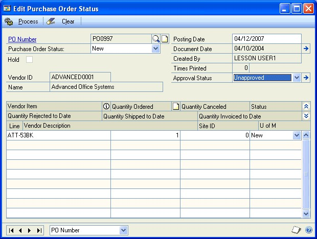

1.  Select a purchase order.

>   When you select an existing purchase order, the Approvals Status field will
>   display the approval status for the purchase order.

1.  Select an approval status for the purchase order.

>   When you approve a purchase order, your Approval Authority Amount will be
>   compared to the Remaining PO Subtotal amount. If the subtotal amount exceeds
>   your approval authority, the Approval Status will change to Unapproved and
>   the related approval information will be cleared. If the subtotal amount is
>   within your approval authority, the purchase order will be approved.

>   *If purchase order commitments is activated, the purchase order must be
>   authorized for commitments before you can approve it. To authorize the
>   purchase order for commitments, go to the Purchase Order Entry window. When
>   you approve the purchase order from that window you will be asked whether
>   you want to authorize the committed budget amount.*

1.  Choose Process.

2.  Close the Edit Purchase Order Status window. You will have the option to
    print the Purchase Order Approval Audit Report—a report which details all of
    the purchase orders you approved.

Chapter 4: Approvals inquiries, reports, and maintenance
--------------------------------------------------------

>   With purchase order approvals, you can use maintain approval information for
>   each company. You also can view or print purchase order approval
>   information.The following reports allow you to view or print approval
>   status, name of the approver, date and time of approval for applicable
>   purchase orders:

-   Purchase Order Status Detail Report

-   Purchase Order Status Summary Report

-   Purchase Order History Detail Report

-   Purchase Order History Summary Report

>   *These are modified reports. If you need to print or view the original
>   reports without the Approval Status line, you must remove access to modified
>   reports using the Alternate/ Modified Forms and Reports window.*

>   This information is divided into the following sections:

-   *Viewing or printing the Purchase Order Approvals User Setup List*

-   *Viewing unapproved purchase orders*

-   *Viewing purchase order detail information*

-   *Viewing item information for purchasing documents*

-   *Printing purchasing documents*

-   *Maintaining purchase order approvals data*

### Viewing or printing the Purchase Order Approvals User Setup List

>   The Purchase Order Approvals Setup List Report details all the users you
>   have set up, their Approval Authority Amount, Report to User ID, and
>   security type. This report will be useful for validating that users have
>   been set up correctly.

>   **To view or print the Purchase Order Approvals User Setup List:**

1.  Open the PO Enhancement Setup window.

>   (Microsoft Dynamics GP menu \>\> Tools \>\> Setup \>\> Purchasing \>\>
>   Purchase Order Enhancements)

1.  Verify that the Activate Approvals check box is marked.

2.  Choose Approval Setup. The Purchase Order Approval User Setup window will
    open.

3.  Choose File \>\> Print, or click the Print button.

### Viewing unapproved purchase orders

>   Use the Unapproved Purchase Order Inquiry window to view and report
>   unapproved purchase orders. The Unapproved Purchase Order Inquiry window
>   displays all unapproved purchase orders created by the current user.

>   **To view unapproved purchase orders:**

1.  Open the Unapproved Purchase Order Document Inquiry window.

>   (Inquiry \>\> Purchasing \>\> Unapproved Purchase Order Document)

1.  Select from the following purchase order filter preferences on the
    Restricted By drop-down menu.

>   **PO Number** Unapproved purchase orders with purchase order numbers within
>   the range you specify will be displayed.

>   **Vendor ID** Unapproved purchase orders with Vendor IDs within the range of
>   Vendor IDs you specify will be displayed.

>   **PO Date** Unapproved purchase orders with purchase order dates within the
>   range you specify will be displayed.

1.  Choose Redisplay to display all unapproved purchase orders created by the
    current user.

2.  To print the Purchase Order Approvals Unapproved PO Report, a report that
    lists unapproved purchase orders, choose File \>\> Print, or click the Print
    button.

3.  When you are finished viewing the information, choose OK.

### Viewing purchase order detail information

>   You can view detailed purchase order information using the Purchase Order
>   Inquiry Zoom window. The PO Approvals Detail Zoom window is an additional
>   window that will open automatically. This window displays the purchase order
>   approval information. You can close this window only by closing the Purchase
>   Order Inquiry Zoom window.

>   **To view purchase order detail information:**

1.  Open the Purchase Order Processing Document Inquiry window.

>   (Inquiry \>\> Purchasing \>\> Purchase Order Documents)

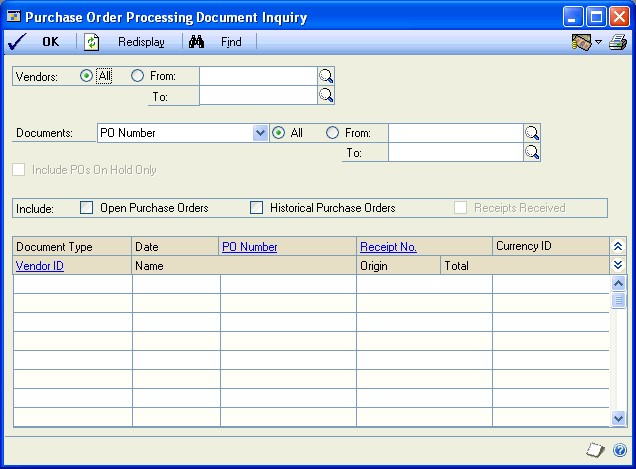

1.  Select the applicable fields to complete your inquiry—refer to the Purchase
    Order Processing documentation for complete instructions.

2.  Choose Redisplay to display the documents in the scrolling window.

>   *For Purchase Orders that are entered as Blanket or Drop-Ship Blanket, the
>   control line amount is excluded from inquiries and reports.*

1.  To print the Purchasing Document Inquiry Report, choose File \>\> Print, or
    click the Print button.

2.  Highlight a record and click on the link to view more detailed information
    (optional).

3.  When you are finished viewing the information, choose OK.

### Viewing item information for purchasing documents

>   You can obtain detailed item information for purchasing documents using the
>   Purchase Order Processing Item Inquiry Zoom window. The Approvals Status
>   field displays the purchase order approval status.

>   **To view item information for purchasing documents:**

1.  Open the Purchase Order Processing Item Inquiry window.

>   (Inquiry \>\> Purchasing \>\> Purchase Order Items)

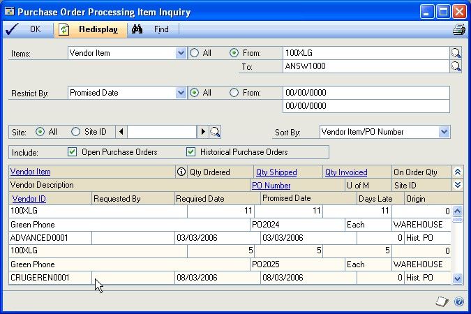

1.  Select the applicable fields to complete your inquiry. For information on
    Purchase Order Inquiry, refer to the Purchase Order Processing
    documentation.

2.  Choose Redisplay to display the items in the scrolling window.

3.  To print the Purchase Order Processing Item Inquiry Report, choose File \>\>
    Print, or click the Print button.

4.  To view more detailed information, highlight a record and click on the PO
    Number heading link—the Purchase Order Inquiry Zoom window will open. The
    Approvals Status field displays the purchase order approval status.

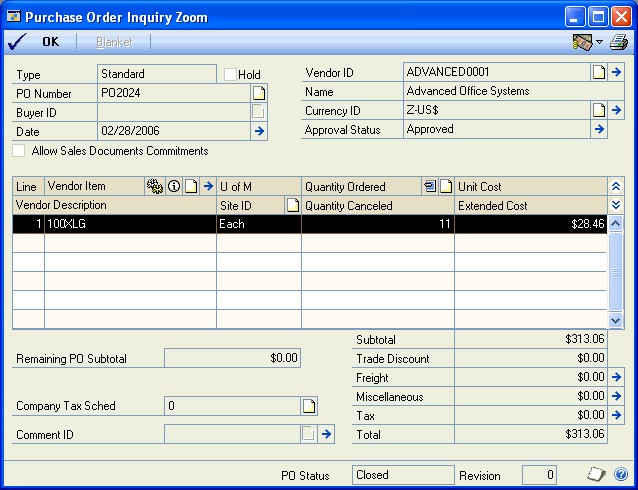

1.  When you are finished viewing the information, choose OK.

### Printing purchasing documents

>   Use the Print Purchasing Documents window to print purchasing documents.

>   *Unapproved purchase orders will not be printed. The PO Approvals Exception
>   report will be generated if any unapproved purchase orders are found in the
>   selected printing range.*

>   **To print purchasing documents:**

1.  Open the Print Purchasing Documents window.

>   (Transactions \>\> Purchasing \>\> Print Purchasing Documents)

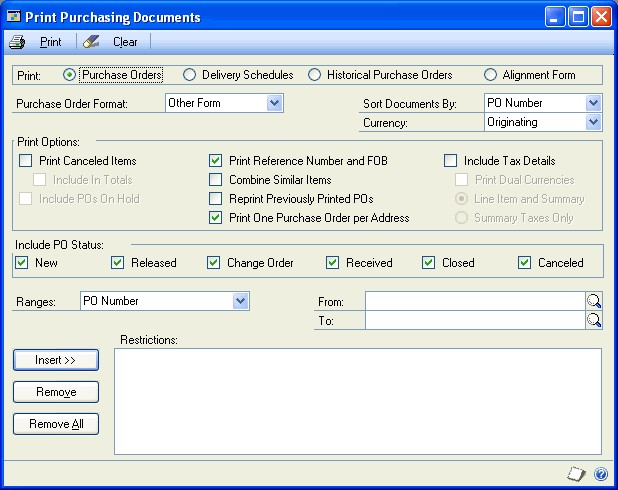

>   Select your printing preferences. For more information on printing
>   preferences, refer to the Purchase Order Processing documentation.

1.  Choose Print. The Purchasing Document and Exception report, which includes
    only approved purchase orders, will be printed.

>   If any unapproved purchase orders are found in the selected printing range,
>   the PO Approvals Exception report which lists unapproved purchase orders
>   will be generated.

### Maintaining purchase order approvals data

>   Occasionally, hardware failures, power surges and other problems can damage
>   or destroy your data. To minimize the risk of data loss resulting from table
>   damage, back up your accounting data regularly. If approvals or commitments
>   data is damaged, you can use the PO Enhancements Maintenance window to
>   reconcile data in the purchase order commitments and purchase order
>   approvals tables. See *Maintaining purchase order commitments data* for
>   information about how to reconcile data in these tables.
