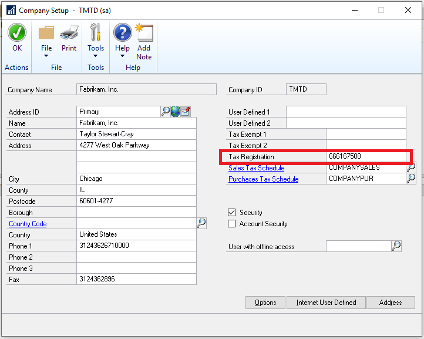
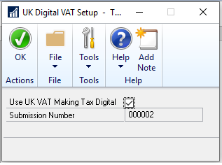
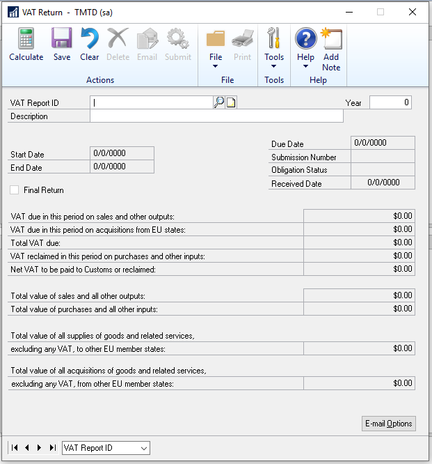
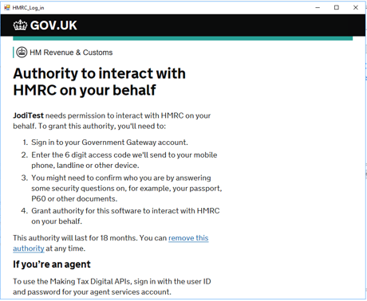
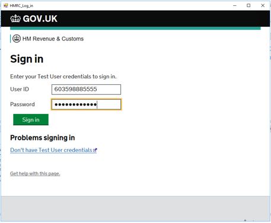
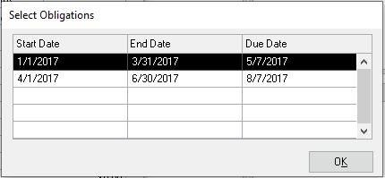
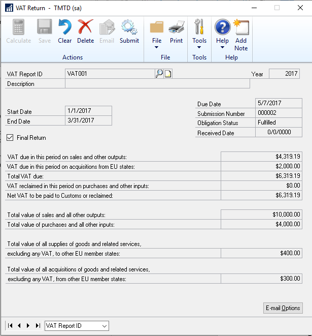
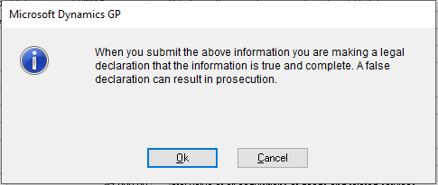
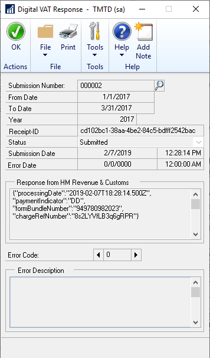

# VAT in the British Version of Microsoft Dynamics GP

Her Majesty's Revenue and Customs (HMRC) is implementing the first step of Making Tax Digital, which imposes new requirements on VAT registered businesses above the VAT threshold. Requirements will be implemented in phases. In the first phase, with a deadline in April, 2019, the following requirements will take effect:

* Keeping records digitally - Businesses must now keep all their records digitally. For users of ERP systems this will not have any impact since they already keep their records digitally in these systems.  
* Submit VAT return electronically using [software recognized by HMRC](https://www.gov.uk/guidance/software-for-sending-income-tax-updates).  

## Set up Making Tax Digital for VAT

The Making Tax Digital feature uses a service connection to communicate with HMRC.

In the **Company Setup** window, you must specify your company's tax registration number.

In the **UK Digital VAT Setup** window (Cards -> Company-UK Electronic VAT Setup), you must specify that you want to use the Making Tax Digital service.  

    

### Set up VAT returns

HMRC maintains a list of VAT obligations for companies, which are the periods for which they must report VAT and the due date for the report. HMRC exposes this information through their API so that Dynamics GP can retrieve the obligations. Dynamics GP stores VAT obligations as **VAT Return Periods**, and uses them to:

* Remind you about VAT returns that are due or overdue.  
* Automatically enter start and end dates when you create VAT returns.  

In order to use the Making Tax Digital service, you must connect to the service from the **VAT Return** window.

    

To enable the connection, you must create a new VAT return.

#### To connect to the Making Tax Digital service

1. In the **VAT Return** window, enter a VAT Report ID, and then enter a year (this is the year that your VAT tax obligation is due).

2. Once you tab off the **Year** field, the **HMRC Log in** window appears where you can login to the HMRC site.

    

    

3. Grant authority to the software application to access your VAT information. 

    

4. After you have successfully logged in, then the **VAT Obligations** window opens, and you can choose your obligation period. This comes from the HMRC site and will return your company’s VAT periods.

    

    The screenshot above is based on a test environment with quarterly VAT tax and only 2 obligation periods open. Your view will be different.

5. When you return to the **VAT Return** window, VAT is calculated for you as shown in the following picture.

    

    If the calculations are not correct, you can clear the window at this time. Then repeat steps above when ready. Click **Save** to save the information.

6. When you save the VAT return, the **Final Return** checkbox becomes editable. You must choose it before you can submit.

    

    If the **Final Return** is marked, the VAT box fields are also made editable. If needed, you can edit the fields in this window now.

    

7. Click **Submit** to start the submission. You must supply your HMRC credentials again.

    You will get a mandatory message required by HMRC, click ok and then you will see a progress bar for the VAT information being submitted to HMRC.

    

When the submission is complete you will see the VAT Response window.

    

> [!NOTE]
> After submitting the return, if the progress window does not start and there is no response window, it could be a proxy server issue. For more information, see [https://developer.service.hmrc.gov.uk/api-documentation/docs/reference-guide#network-access](https://developer.service.hmrc.gov.uk/api-documentation/docs/reference-guide#network-access)  
