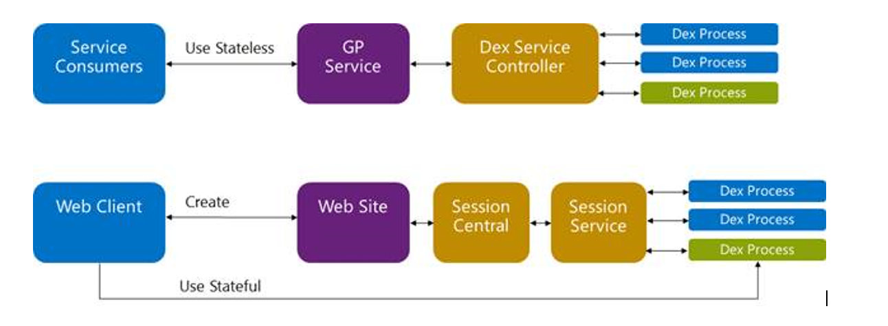

# Service Based Architecture for Dynamics GP

Service Based Architecture (SBA) is a method for enabling applications and services that Microsoft and its partners create to be able to access GP functionality through a standards-based services model.

To boil this down, it means that we can utilize the logic that is already created in a dictionary in a GP client and expose that to an endpoint for consumption.

Exposing logic to a WCF endpoint is not an entirely new concept. In GP 2010, eConnect began utilizing a WCF endpoint to execute logic that was in a set of stored procedures. This stored procedure logic was maintained separately from the logic in the dictionary.

The difficulty with having two sets of logic is that they both need to be constantly synchronized to provide the full functionality. For example, if a new feature in Purchase Order Processing is created, the eConnect stored procedures for Purchase Order Processing need to be altered to honor the new feature and treat the transaction in the same way as the GP Client. 

With SBA utilizing the same logic that as the GP Client, this synchronization process does not need to occur.

## Design

The introduction of the Web Client in Microsoft Dynamics GP 2013 paved the way for the creation of this product. The deployment is similar, and the same technologies are used.

Here is an architectural breakdown of the difference:

There are two main differences between the Web Client and SBA. The first is that unlike the Web Client which connected directly to the Dex Process, SBA connects to the Dex Process via the GP Service and the Dex Service Controller. 

The second is the nature of the connection. The Web Client requires a stateful connection. Should the state be lost, we see an Async error. With SBA, the connection is stateless.

## What can be done with Service Based Architecture?

The following actions can be done with SBA:

- GET – Obtain a list of objects or details on a specific object. Examples of this would be to get a list of customers or to get information on a specific transaction
- POST – This action is used for the creation of an object. An example would be to create a vendor address 
- PATCH – When an update needs to be done, this HTTP Request Type is used. The object (i.e. Customer) must exist for this to be used.
- DELETE – This is used when an object needs to be deleted. The object must exist and must meet the rules in order to be deleted.

Here is what is exposed to SBA with Dynamics GP 2015 RTM:

- Administration
  - Countries
  - Currencies
  - Payment Terms
- Companies
- Financials
  - Checkbooks
  - Setup
  -	Currency Accounts
- Inventory
  - Classes
  - Item Currencies
  - Item Price Lists
  - Items
  - Item Sites
  - Item Vendors
  - Lot Categories
  - Price Groups
  - Price Levels
  - Sites
  - Transaction Headers
  - Transaction Lines
  - Transactions
  - Unit of Measure Headers
  - Unit of Measure Lines
  - Unit of Measures
- Modules
- Products
- Purchasing
  - Payables
  - Transactions
  - Requisitions
  - Transaction Headers
  - Transaction Lines
  - Transactions
  - Vendor Addresses
  - Vendors
- Sales
  - Classes
  - Customer Addresses
  - Customers
  - Receivables
  - Transactions

Not all actions above are available on each of the objects.

## What technologies should be understood before deploying Service Based Architecture?

The technologies for deploying the Web Client are the same for deploying Service Based Architecture.  

An understanding of the following technologies is needed for the installation:

- Internet Information Systems (IIS)
- Creation and implementation of SSL Certificates
- Hardware\Software Firewalls (if they are in the environment)
- Installation of a Dynamics GP Client
- Tenant Services (if having a Multitenant environment is desired)

## Prerequisites

### Dynamics Utilities

The user that will be calling the Service Based Architecture endpoint must be tied to a GP User. In order to tie a GP User to a Windows Login, a Web Client SQL Server Login must be created. 
The Web Client SQL Server Login is created in Dynamics Utilities.
Launch Dynamics Utilities and proceed to the Additional Tasks window. Select Manage Web Client SQL Server Login from the Tasks drop-down menu.

With Manage Web Client SQL Server login selected, click the Process button. The Manage Web Client SQL Server Login window will be displayed.

The user that is created\specified in this window should NOT be a GP user. 
Once the information has been entered on this window, click the Save button.
Once this user is saved, the user will be given access to the System and Company databases and will have access to all of the objects in those databases.
This user cannot log into Dynamics GP and this user cannot be used in another application, like Microsoft Office Excel, to access the data because of the encryption on the password.
