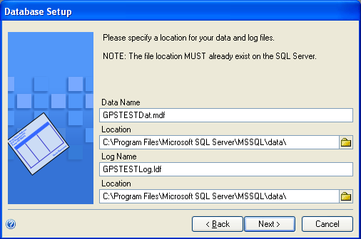
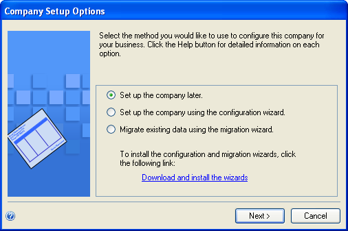

# Creating a company

Use the instructions in this chapter to create a company if you didn't create one when you first used Dynamics GP Utilities. You must set up at least one company before you can start Dynamics GP. See your System Setup instructions (Help &gt;&gt; Contents &gt;&gt; select Setting up the system) for information about setting up users and companies in Dynamics GP.

## Chart of accounts overview

Several default charts of accounts are included with your Dynamics GP

system. You may want to use a default chart of accounts for the following reasons:

- The charts of accounts we've provided reflect sound accounting practices.

- Extensive research was done to determine the most commonly used account types for the industries we've included.

- Even if changes need to be made after a default chart of accounts is copied for the company, setup time will be greatly reduced by using a default chart.

Based on the business and industry types you choose for your company, you can install the chart of accounts best tailored for your company's business needs. For instance, if your company is a retail corporation, select Corporation from the Business Type list, as shown in the previous illustration, then select Retail from the Industry Type list. Accounts specific to corporations, such as stock accounts, will then be added to the chart of accounts specifically designed for retail industries.

If you use a default chart of accounts, you won't be able to shorten the account format. However, it can be lengthened to the maximum length you established in the Account Definition Setup window of Dynamics GP Utilities, earlier in the installation process. Refer to the System Setup instructions (Help &gt;&gt; Contents &gt;&gt; select Setting up the system) for more information about lengthening account formats.

The default chart of accounts you choose for your company in this procedure is designed to be an accurate estimate of your company's business practices. However, we recommend that you review the accounts and make any necessary additions or changes. You'll be directed to the General Ledger documentation later in the setup process, if you need to modify the accounts.

## Adding a company using Dynamics GP Utilities

Use Dynamics GP Utilities to create companies for Dynamics GP. You must have at least one company set up before you can start Dynamics GP.

When adding a company, you can select how to configure your company. You can use wizards to migrate data from QuickBooks or Peachtree and enter basic configuration options, or you can configure the company later using the Setup Checklist window in Dynamics GP. To use a tool to migrate or configure data, you must download and install the Rapid Implementation Tools for Dynamics GP. If you haven't installed the Rapid Implementation Tools, click the Download and install the wizards link in the Company Setup Options window.

Before you begin, be sure you have adequate space to add companies (including the sample company) to your SQL database. Each company requires about 300MB of free space.

When you create a company, you can deploy SQL Server Reporting Services reports and Excel reports using Dynamics GP Utilities. If you have deployed reports for your system database, you can use the default report locations for the company.

To start Dynamics GP Utilities, you must have appropriate user privileges. Typically, this means being part of the Administrators group or the Power Users group. If you are using an operating system that has User Account Control (UAC) enabled, you will be prompted to run the program as a user with administrative privileges. Refer to your operating system's documentation for more information.

To add a company using Dynamics GP Utilities:

1. Start Dynamics GP Utilities.
(Start &gt;&gt; Programs &gt;&gt; Microsoft Dynamics &gt;&gt; GP&gt;&gt; GP Utilities)

2. In the Welcome to Dynamics GP Utilities window, verify your server name, and enter a system administrator user ID and Password; then click Next.

  

3. In the Welcome to Dynamics GP Utilities window, review the information and click Next.

4. The Upgrade Dynamics GP window opens, indicating that Dynamics GP is at the current version. Click Next to verify version information for companies.

5. After companies are verified, the Additional Tasks window opens. Select Create a company and then click Process.

6. The Create Company window opens, where you can enter a database/company ID, and a company name. You also can select the following options.

   - Mark to load shipping methods and payment terms.

    - Mark the Load Default Chart of Accounts option and click a business and industry type. For more information about charts of accounts, see [Chart of accounts overview](#chart-of-accounts-overview).

    - Copy access from another company, except from the sample company, Fabrikam, Inc.

  

> [!NOTE]
> If you choose to use wizards to migrate QuickBooks or Peachtree data and enter basic configuration information in step 10, the shipping methods and payment terms and the chart of accounts information you have loaded may change.  

7. Click Next after entering and selecting company information.

8. The Database Setup window appears. Enter the location where the data and log devices should be created. Click Next.

  

9. The Very SQL Server window appears. Confirm your selections. If the selections are correct, click Finish.

    The Server Installation Progress window appears, showing progress as tables loaded.

10. In the Business Intelligence Reports Setup window, select the business intelligence components to deploy. Click Next. The window that opens depends on the components you selected.

    If you don't want to deploy business intelligence components, leave the components unmarked and click Next. The Company Setup Options window appears. Skip to step 18.

11. The SQL Server Reporting Services Reports Setup window appears if you marked to deploy Reporting Services reports. After selecting your report server mode, enter the locations to deploy the reports to. Be sure that the location you enter does not end with a slash.

Native mode location example:

| Location           | Example                                |
|--------------------|----------------------------------------|
| Report Server URL  | https://&lt;servername&gt;/ReportServer |
| Report Manager URL | https://&lt;servername&gt;/Reports      |

SharePoint Integrated mode location example.

| Location |         Example      |
|-----------------------|----------------|
| SharePoint Site       |                |
| Report Library        | ReportsLibrary |

12. If you have selected Native as the report server mode, you can enter the name of the folder to deploy the reports to. By using a folder, you can deploy Reporting Services reports for multiple Dynamics GP instances to a single Microsoft SQL Server Reporting Server. The default folder name is the name of the system database. If DYNAMICS is the system database name, the Folder Name field is blank. After deploying reports to the folder, you must provide access to the folder.

13. Click Next.

> [!NOTE]
> If you don't have the appropriate permissions to deploy reports, a window opens where you can enter a domain\\user name and the password you use to log in to Microsoft Windows.  

16. The Excel Reports Setup window appears if you marked to deploy Excel reports. Select the location to deploy the reports to.

If you have selected SharePoint as the location to deploy reports to, you can mark the Using SharePoint Online option if you are using Microsoft 365 and want to deploy Excel reports to a reports library in SharePoint Online 2010. Mark the Using SharePoint Online option to deploy reports only in the Dynamics GP desktop client. Reports will not be deployed for the Dynamics GP Web Client.

Be sure to use back slashes when you are entering the location for reports even if you are using a UNC path. You should also be sure that the location doesn't end in a slash.

Network share location example:

|Network        |Location                   |
|---------------|---------------------------|
| Network share | \\\\Servername\\sharename |

SharePoint location example.

| SharePoint Site          | Server          |
|--------------------------|-----------------|
| Data Connections Library | DataConnections |
| Report Library           | ReportsLibrary  |

17. Click Next.

> [!NOTE]
> If you don't have the appropriate permissions to deploy reports, a window opens where you can enter a domain\\user name and the password you use to log in to Microsoft Windows.  

18. The Verify SQL Server window appears. Confirm your selections. If the selections are correct, click Finish.

    The Business Intelligence Deployment Progress window appears. This window displays the report deployment progress.

19. The Company Setup Options window appears, where you can select one of the following options to configure your company.

    - Mark the Set up the company later option to set up your company at another time. When you are ready to set up data for your company, you can use wizards to migrate data from QuickBooks or Peachtree and enter basic configuration options, or you can configure the company using the Setup Checklist window in Dynamics GP.

    - Mark the Set up the company using the configuration wizard option to use the Rapid Configuration Tool for Dynamics GP. The Rapid Configuration Tool helps you enter the basic setup information required for Dynamics GP. With the Rapid Configuration Tool, you can start with a standard industry configuration, modify the configuration data, and then import the data into Dynamics GP. Or, you can import a configuration from an Excel workbook prepared by a Dynamics GP partner or business consultant.

    - Mark the Migrate existing data using the migration wizard option to use the Rapid Migration Tool for Dynamics GP. The Rapid Migration Tool migrates QuickBooks data or Peachtree to Dynamics GP. You can migrate master records, transactions, and configuration settings such as payment terms and shipping methods. Master records include customer records, vendor records, item records, and account records. Transactions include open payables transactions, open receivables transactions, open invoices transactions, and purchase orders. You also can review and edit information before you complete the migration.

To use a tool to migrate or configure data, you must download and install the Rapid Implementation Tools for Dynamics GP. If you haven't installed the Rapid Implementation Tools, click the Download and install the wizards link.

  

20. Click Next. If you decided to configure your company later, the Additional Tasks window reappears. You can click Create a company to set up a second company, start Dynamics GP, or Exit.

    If you decided to migrate or configure your company data, the Rapid Migration Tool or the Rapid Configuration Tool starts.
