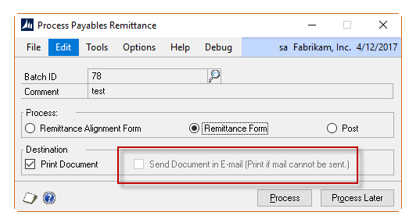
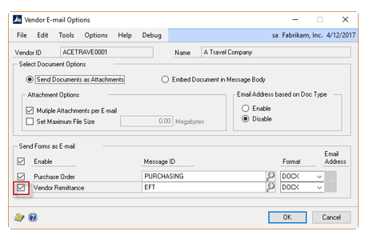
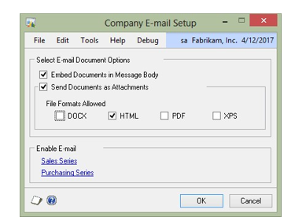
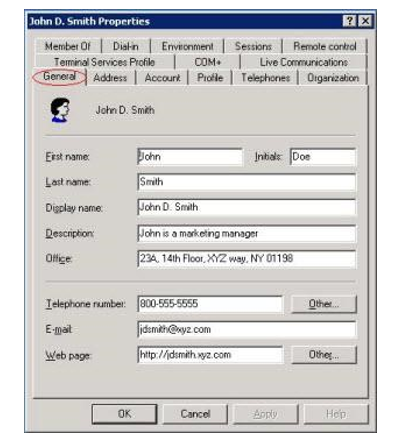

# Microsoft Dynamics GP Email Troubleshooting Guide

This document is meant to walk through most of the errors you may run into when emailing out of Microsoft Dynamics GP.  

The goal is to make everyone an emailing expert!  

This document can be leveraged with all email functionality in Microsoft Dynamics GP, from the old Standard Report Writer Statement emailing method, to Word Templates.

> [!NOTE]
> Currently, TLS 1.0 and Basic Authentication (no MFA) are required for Exchange and Workflow emailing in Dynamics GP.
>
> We are aware of the changes that are coming to the supportability of TLS 1.0 and Basic Authentication within our other Microsoft applications. TLS 1.2 and Multi-Factor Authentication (MFA) functionality was included in the 18.3 update released.

All email issues can be safely split up into three sets of issues:

* Items unique to MAPI  
* Issues unique to Exchange  
* Those that both methods have in common  

This is how the documentation is organized: Starting with MAPI, moving onto Exchange, and ending with the common errors.  

Find system preferences under Dynamics GP Tools -> Setup -> System -> System Preferences.  

> [!IMPORTANT]
> This setting is stored in the DYNAMICS database and is system-wide, so changing this setting will affect all users.  


## MAPI Specific Errors
Dynamics GP uses MAPI to open Outlook to send emails directly from the Outlook client.

### Emails Stuck in Outbox within Outlook. 

Note: Issue appears to be unique to Gmail accounts.  

Issue:  
Emails are getting stuck in the Outbox in Outlook. 

When you use the Send/Receive button, or close/reopen Outlook, the email sends without delays.  

Cause:  
Add-in for Gmail Multi-factor authentication. This is a paid add-in that we believe causes the issue.  

Solution:  
Compare a clean Outlook add-in list to the client having the issue to make sure there are no extra add-ins.  
Recommend that they [remove the add-in as it appears like it is no longer needed](https://support.office.com/article/add-a-gmail-account-to-outlook-701916679c52-4581-990e-e30318c2c081)

### No default mail client, or the current mail client cannot fulfill the message request

Please run Microsoft Outlook and set it as the default mail client.  

Note: Recommend you review Outlook version first – MAPI only works with 32bit!  

Issue:  Error appears when attempting to email using MAPI anywhere in GP Cause: Either a Profile is not setup, or Outlook cannot reach it using MAPI.  

Solution: You can go through [this KB](https://support.microsoft.com/help/4052892/e-mail-error-in-microsoftdynamics-gp-either-there-is-no-default-mail), focus on A and B as these are common causes.  

You will want to make sure that Outlook is also set up as the default application for mail when you search for Default Apps in Windows 10.  

### A program is trying to send an e-mail message on your behalf

Note: Happens a lot with more secure environments and newer versions of Office.

Issue: Outlook does not trust Microsoft Dynamics GP by default.

Cause: Simply put, Outlook does not start with any Microsoft Dynamics GP specific trusts, so they need to be added.  

Solution: There are two solutions to get this message to stop appearing, we currently recommend the Outlook solution (first one in the list) as it has no side-effects.  
The Microsoft Dynamics GP solution does have side effects which are mentioned in the link provided  

1. Outlook solution (recommended)  

      1. Use the following link to solve the issue by telling Outlook that GP is a [trusted program](https://support.microsoft.com/help/3189806/a-program-is-trying-tosend-an-e-mail-message-on-your-behalf-warning-i)  

          Note: This may need to be redone anytime you upgrade GP/Office versions.

2. Dynamics GP Workaround (Has side-effect of the emailed document containing the file path that it was sent from)  

    1. [Force Outlook to use a different version of MAPI](https://community.dynamics.com/gp/b/dynamicsgp/posts/draft-a-program-is-trying-to-send-an-e-mail-message-on-your-behalf-when-trying-to-send-a-template-via-e-mail)
    
        This has many side effects which are mentioned in the above article.

Note: This may need to be redone anytime you upgrade Office  

### Microsoft Dynamics GP Crashes after an Office Update

Note: Only happens past Microsoft Office version 1810, happens to all versions of Microsoft Dynamics GP. 

This ONLY effect emailing functionality. This includes any time where an email address would be entered within GP. Specific to MAPI.

Issue: Office no longer allows for sideloading of VBA.

Cause: The Microsoft Dynamics GP attempt to use its own packaged version of VBA, and Office no longer allows this.

Solution: The solution is to remove VBA, stay on a version of Office prior to 1810, or to use Exchange rather than MAPI functionality. 

For more information regarding the cause of this issue, see [this blog post](https://community.dynamics.com/gp/b/dynamicsgp/posts/dynamics-gp-crashes-closeswhen-emailing-after-office-update)
and [blog post about Microsoft’s stance on the solutions](https://community.dynamics.com/gp/b/dynamicsgp/posts/dynamics-gp-and-vba-futureconsiderations)

## Exchange Specific Errors

Dynamics GP uses Exchange Autodiscover to find the Exchange EWS endpoint, then uses this endpoint to login to, and send emails through, Exchange.  

### Login Failed: check your login information and try again

Note: Note: Error appears when attempting to login to the Exchange Log On screen.

Issue: Something is keeping Microsoft Dynamics GP from being able to successfully connect to the Exchange Server.  

Cause: There are a multitude of possible causes for this issue. The most common issues are an Autodiscover issue, an issue with MFA (Multifactor Authentication), or Basic Authentication being disabled.  

Solution: The following path is the best route for generic login issues: 

1. Confirm MFA is disabled  

    If it is enabled, attempt to use an App Password instead of the account’s normal password. For more information, see [App Passwords] (https://support.microsoft.com/help/12409/microsoft-account-apppasswords-and-two-step-verification)  

2. Confirm that Basic Authentication is enabled  

    Most Exchange Administrators can answer this for you, although the [this blog post outlines other routes to confirm the status of Basic Authentication](https://community.dynamics.com/gp/b/dynamicsgp/posts/exchange-online-o365-emailing-inside-dynamics-gp)  

3. Confirm that Autodiscover is working  

    You can do this by removing the user from the SY04920 table (Dynamics/System database) and attempting to login again. If this table does not repopulate, then there are Autodiscover issues in the system (or the user doesn’t work). For insights into how this all works, along with other tests, see [this blog post](https://community.dynamics.com/gp/b/dynamicsgp/posts/exchange-emailinginside-dynamics-gp)  

## Generic Errors

### PDF Not Created

Note: Issue Specific to Upgrades to GP 2013 SP1  

Issue:  User is attempting to e-mail the customer statement but is receiving an error that the PDF file was not generated.

Cause: When disabling the customer statements via Tools>>Setup>>Sales>>E-mail settings, it doesn’t update the SY04905 table. 

Solution: Use the steps below to workaround around the error message:

To get around this, the users need to follow these steps to update the customer cards before they disable the Customer Statement:  

1. Verify that the Customer Statements are enabled to be emailed(Tools>>Setup>>Sales>>E-mail Settings)  
2. Go to the Customer Navigation List and select all customers.  
3. Use the E-mail Settings option (top navigation bar) here to update all customers.  
4. Here you will need to check **Customer Statements**, then select **PDF**, and uncheck the **Customer Statement** option. Then click OK.
5. You should see that the customer cards were updated
6. Running the following script should show the EmailDocumentEnabled field has been set to 0 for all customers:  

    ```select * from SY04905 where EmailDocumentID = '10'```

7. Disable the **Customer Statement** option on the **E-Mail Settings** window in **Sales Setup**.  
8. The statements should generate as a PDF file now for all customers.  

### Unknown Error Occurred

Note: Issue usually happens to EFT Remittances in Payables.  

Issue:  User is attempting to e-mail remittances but the error above appears on the Email Exception Report.  

Cause: This error has many causes, usually comes down to customizations on the Template, or odd characters in the email addresses used.  

Solution: Try the following:

Error messages when you email RM Statements in Microsoft Dynamics GP: [Unknown Error or Insufficient Memory](https://community.dynamics.com/gp/b/dynamicsgp/posts/error-messages-when-you-email-rm-statements-in-microsoft-dynamics-gp-unknown-error-or-insufficient-memory)

Use default report and Template and make sure the Template is the one marked with an Asterisk (*).
[If the default works, check the bookmarks on the modified template](https://community.dynamics.com/gp/b/dynamicsgp/posts/what-are-bookmarks-and-how-are-they-used-in-microsoft-dynamics-gp-s-word-templates) 

Remove all email addresses being used and reenter them. Make sure that there are no odd characters such as ^ or a Tab.
This issue can occur with all reports, and these can be caused by MessageID issues or Reply To issues. Make sure to remove all MessageIDs and Reply To emails.  

### No Error, but no emails are sent (0 Documents Sent)

Note: Common issues for RM Statements or EFT Remittances.  

Issue:  User is attempting to e-mail documents, but nothing happens. All exception reports will show that no documents were sent.  

Cause: This issue has many different causes, and there are no errors.  

Solution: Try the following:

Test a default report in GP, we recommend the User Report:

1. Go to Administration >> Reports >> System >> Users  
2. Under Reports: Select User Notes  
3. Click New  
4. Option: Enter TEST  
5. Ranges: Select a User ID  
6. Click Insert  
7. Click Email Options  
8. If using Exchange, it will prompt you for your Exchange Log On  
9. Enter your own email address in the To field  
10. Click OK  
11. Bring up the TEST report and click Email  

If the test email works, you will want to check the modified report in Report Writer:
First, [check the Sections within Report Writer](https://blogs.msdn.microsoft.com/developingfordynamicsgp/2013/02/25/copying-report-formats-between-reports-and-a-warning-about-word-templates/)

Check the Font sizes in Report Writer (keep all fonts over size 5).

Review the Template for any issues:

* Missing Bookmarks is the most frequent cause for the e-mails to fail outside of system issues.  

    [Verify all bookmarks are present](https://community.dynamics.com/gp/b/dynamicsgp/posts/what-are-bookmarks-and-how-are-they-used-in-microsoft-dynamics-gp-s-word-templates)

* Text Boxes will cause the template to fail.  

    A user should never put a text box inside of a template.  It will cause an error when generating that may not show within GP

* GP 2010 - 32-Bit Office must be used for GP2010 - Uninstall and reinstall >> Click 32 bit install

* GP 2013 or newer 32 or 64-bit Office can be used with GP2013. If using 64 bit the server type in System Preferences (Microsoft Dynamics GP | Tools | System | Setup | System Preferences) must be set to Exchange.

* Special characters in the reply to email address cause the e-mail to fail in Outlook.  If the user is using a reply to address, remove this from both the E-mail Message ID and module e-mail setup.  

    Go to Sales >> Cards >> Customer >> E-Mail button and remove the Message ID

    Also go to Sales >> Setup >> E-mail Settings Remove the any Reply To email address entered. Enter a new invoice for the customer and test the email. 

* Default e-mail profile not setup
    Review the  MAPI Specific issues Above for more information on this.

* If using a terminal server/Citrix environment, Outlook must be open on the server for using MAPI

* Another common issue with e-mail is when users get a new workstation. They may have to update the Registry when using MAPI.  They can do this by following the steps in the MAPI Specific issues above.


### Send Documents in email check box is grayed out when trying to send a Remittance

Note: Common issues for PM EFT Remittances

Issue: User is attempting to email Remittances, but the checkbox is grayed out:



Cause: This issue has a few different causes, usually setup or 3rd party involvement Solution: 

Try the following:
1. Check to see if the vendor is setup to allow for emailing:
Go to Purchasing >> Cards >> Vendor >> select a vendor >> E-mail.
In the Send Forms as Email section confirm that Vendor Remittance check box is checked.




If this is correct, check to see if Mekorma MICR is installed, if so make sure the Mekorma MICR System Options are set to have email enabled, or else the **Send Document in email** checkbox in the Remittance window will not be available to mark (or grayed out). To check this setting, go to Microsoft Dynamics GP | Tools | Setup | System | Mekorma MICR | System Options. Choose the **Enable Email Remittance** field, and then click Save.

[For more information, see this blog post about this process](https://community.dynamics.com/gp/b/dynamicsgp/archive/2016/10/24/quick-step-guide-to-ehttps://community.dynamics.com/gp/b/dynamicsgp/archive/2016/10/24/quick-step-guide-to-e-mail-pm-eft-remittances-in-mdgp-2015-2016mail-pm-eft-remittances-in-mdgp-2015-2016)


### Email button is grayed out in Sales Order Processing

Note: Unique to Sales Order Processing

Issue: User is attempting to from a Sales Order Processing window, but the option to email is grayed out.

Cause: GP will only email the Blank Paper options for reports.

Solution: Try the following:
1. Go to: Sales >> Setup >> Sales Order Processing >> Sales Document Setup button >> select the
2. Document Type they are trying to send (quote, order, invoice etc)
3. Make sure the Format is set to Blank Paper


### You must activate e-mail functionality for this document before it can be sent in email

Note: Companywide setup issue

Issue: User is attempting to email out a document that is not allowed in the company Cause: GP will only allow emailing on documents you tell it to.

Solution: Try the following:

1.	For Sales: Tools>>Setup>>Sales>>E-mail Settings. The document type you are trying to send needs to be selected in this window
2.	For Purchasing:  Tools>>Setup>>Purchasing>>E-mail Settings. The document you are trying to send needs to be selected in this window.


###  The company does not allow the sending of (DOCX, HTML, PDF, XPS) files

Note: Companywide setup issue

Issue: User is attempting to email out a document type that is not allowed in the company Cause: GP will only allow emailing on document types you tell it to.

Solution: Try the following:

To resolve-Tools>>Setup>>Company>>E-mail Settings. Here you will need to enable the document type you are attempting to send




###  A word template must be assigned before sending this document

Note: Companywide setup issue, usually happens to new Template users. 

Issue: User is attempting to email out a modified report that has no corresponding template.

Cause: There is no template assigned to email Solution: Try one the following:

1.	Use the Standard report in the Alternate/Modified Forms and Reports setup window Tools -> setup -> System -> Alternate/Modified Forms and Reports
2.	Create a modified template using the New button on the Template Maintenance window
3.	Reports -> Template Maintenance

Don’t forget to assign the template for either option by using the Assign button on the Template Maintenance window (Reports -> Template Maintenance)


###  Dynamics GP shows Templates Processing, but they never complete or an error appears

Note: There is a template setup, but none are assigned to the company

Issue: User is attempting to email out a report that has no assigned template, but one exists

Cause: There is a template setup, but none are assigned to the company

Solution: To resolve this simply assign a template for the report by using the Assign button on the Template Maintenance window (Reports -> Template Maintenance)
Also check to make sure that that Dexterity Shared Components is installed at a version that matches your version of Microsoft Dynamics GP.


###  This document type cannot be sent in e-mail for this customer/vendor

Note: Common for newly entered customers/vendors, or those that have been imported. 

Issue: User is attempting to email out a document type that has not been enabled for the customer/vendor

Cause: Setup issue on the Customer/Vendor card

Solution: To resolve this simply open the Customer/Vendor Card (cards -> Customer or Vendor) and click the email button. Each document you are attempting to email must be check marked. If these are grayed out, then the Company wide setting is also unmarked. You can find out about this here.


###  A To, CC, or Bcc address could not be found

Note: Common for newly entered customers/vendors, or those that have been imported. 

Issue: User is attempting to email out for a customer/vendor that does not have an email address.

Cause: Setup issue on the Customer/Vendor card

Solution: To resolve this simply open the Customer/Vendor Card (cards -> Customer or Vendor) and click the Internet Information button next to the Address lookup (looks like a planet). You will also want to check for the Email Address based on Doc Type setting found in the email submenu (email button) on the customer/vendor card. If this is enabled, then check all the ‘…’ email addresses to make sure an email address is check boxed.


###  You must have the Microsoft Save as PDF or XPS add-in for 2007 Microsoft Office

Note: Either caused by an item in the KB below or is a performance problem.

Issue: User is attempting to send out a large set of emails

Cause: Performance problem

Solution: [This KB article can sometimes resolve the issue](https://support.microsoft.com/topic/you-must-have-the-microsoft-save-as-pdf-or-xps-add-in-for-2007-microsoft-office-0d9311d8-265e-1cc0-5df2-a5df3297db24)

The more consistent solution is to simply cut down on the number of emails you are sending out at once. 

For example, run your Invoices for one half of your customers, then the other half.

In rare cases the issue is caused by a conflict with a third party add-in. The easiest way to confirm if this may be the case is to rename the GP code folder and then run a repair of GP. This will recreate a new GP code folder without third parties. If the issue continues you can just delete the new folder and rename the old folder back. If the issue is resolved then you can add third parties one-by-one until the issue reoccurs.


## Workflow

Workflow email issues usually fall into two possible causes: SMTP issues and Setup issues, overall you can figure out which is which by using the ‘Test E-mail’ button on the Workflow Setup window (GP -> Tools -> Setup -> System -> Workflow Setup). The following steps are split depending on if the test email is received or not.

### My SMTP Test Failed

If you never received the Test E-mail, then you are likely having an issue with SMTP.

First, confirm that you are not using MFA on the account used in the SMTP setup.

Next, make sure that TLS 1.0 is enabled on the SQLserver and on the SMTP server.

Then walk through the following articles:
[Workflow Notification Email Troubleshooting – Microsoft Dynamics GP Community] (https://community.dynamics.com/gp/b/markpolino/posts/workflow-notification-email-troubleshooting-microsoft-dynamics-gp-community)

[Workflow Notification Email Troubleshooting] (https://community.dynamics.com/gp/b/dynamicsgp/posts/workflow-notification-email-troubleshooting)


### My SMTP Test Passed

If you received the test email, then you are now looking at an issue with Active Directory or Message IDs.

First, make sure your SQL Server Service account is setup as a domain account in the same Active Directory as your Approvers (Two-way-trust domains also work). 
This account will need permission to query the domain holding the Approvers.

Next, try changing your Message IDs on the Workflow Notifications. 

You can do this by opening the Workflow Maintenance window (GP -> Tools -> Setup -> Company -> Workflow Maintenance). 
Under each step there will be a Send Message field, make sure this is marked and using a default message with a *. 

There are also notification options under the main Workflow tab called ‘Send notifications for completed actions’ make sure these are also using default messages.

Then, check Active Directory and make sure that the Email field on the front of every Approver’s card is filled out with the correct value. 

If it is grayed out, then you are tied to Exchange Online, so these should be correct.





## MFA - Multi-Factor Authentication

- [Set up the application in the Azure Portal](/dynamics-gp/whats-new/multi-factor-authentication)  
- [Configure MFA in Dynamics GP](https://community.dynamics.com/gp/b/dynamicsgp/posts/microsoft-dynamics-gp-fall-2020---multi-factor-authentication)  


## Emailing Setup Guide by Module

The below document covers setup of email starting with System Wide Setup, Purchasing, Sales, and Workflow setup.
Depending what area of email you need to setup, please review the steps outlined below.
- [Emailing Setup Guide](https://community.dynamics.com/gp/b/dynamicsgp/posts/emailing-setup-guide#_Toc71192006)  


