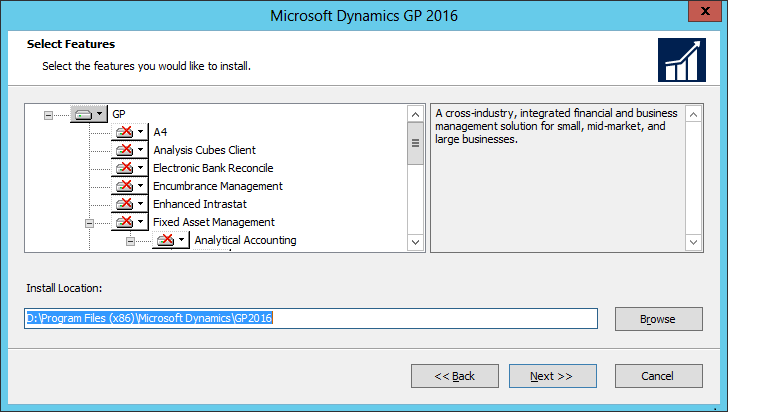
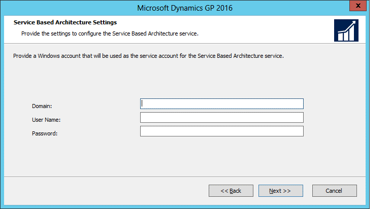

# Install Dynamics GP on the first computer

Use the information in this chapter to install Dynamics GP on the first computer.  

## Installation overview

In a multiuser local area network environment, Dynamics GP applications are typically installed on a server, and then on each client. However, Dynamics GP is not required to be installed on the server. Each client will have access to data stored on the server. You can install your clients using the Dynamics GP media or using a client installation package. For more about creating an installation package for your clients, see [Creating an installation package](creating-an-installation-package.md).  

## Installing Dynamics GP (first computer)

Before beginning the installation, be sure you’ve completed the installation preparation steps listed in Part 1, Preparation, and that no other applications are running.

To install Dynamics GP (first computer):

1. Be sure that you’re logged in to Windows as a user with system administrator privileges.

2. From the Dynamics GP installation media, double-click the Setup.exe file to open the Dynamics GP installation window.

3. If one or more of the following components isn’t installed on your computer, the Dynamics GP Bootstrapper Setup window opens and you can choose to install the missing component or components.

    - Dexterity Shared Components 18.0

    - Microsoft Application Error Reporting 11.0

    - Microsoft Lync 2010 SDK Runtime

    - Microsoft SQL Server Native Client 11.0

    - Microsoft Windows Installer 4.6

    - Microsoft .NET Framework 3.5

    - Microsoft .NET Framework 4.5

    - Open XML SDK 2.0 for Microsoft Office

    - Visual C++ 2015 Runtime Libraries

    - Visual Basic for Applications Core

    After all the components are installed, you may need to restart your computer before continuing the installation of Dynamics GP.

4. Click Dynamics GP.

    The installation program verifies that your system has the minimum operating system required to run Dynamics GP. If your system does not meet requirements, the installation will not continue.

5. If you are installing Dynamics GP on a computer with an existing instance of Dynamics GP, select the Create new instance option, enter a name for the new instance, and then click Next.

6. In the Country/Region Selection window, select the primary country or region where you do business. Your selection affects which features are available to install. Some features are available only in selected countries or regions. Click Next.

7. Follow the instructions in the window to accept the software license agreement. To install Dynamics GP, you must accept this agreement and click Next.

8. In the Select Features window, select the features to install.

      

    When you click a button for a feature, a pop-up menu of options appears. Refer to the table for more information about each option.

    | Option   | What happens   |
    |---------|-------------|
    |  Run from My computer     | The selected feature will be installed on the local hard disk. (This option installs the feature, but not sub–features.) |  
    |  Run all from My computer | Will install the feature and all of its sub–features. |  
    |  Not available            | Will not install the selected feature or sub–features. |  

9. Specify the folder where you want the Dynamics GP files installed. The default folder is C:\\Program Files\\Microsoft Dynamics\\GP 2018. To select a different folder, click Browse.

    After you have specified the installation folder, click Next.

10. Provide the Windows account that will be used as the service account for the Service Based Architecture feature. This dialog is only displayed if you selected to install the Service Based Architecture feature on the Select Features dialog.

11. In the SQL Server window, you can set up an ODBC data source, enter the name you assigned to the SQL Server when you installed Microsoft SQL Server. A data source name called Dynamics GP also is created using SQL Native Client.

    If you don’t want to set up an ODBC data source, mark the Do not create a data source option.

12. Select to use DYNAMICS as the system database name or enter a different name for the system database name.

    By entering a custom name for the system database, you can have multiple system databases on the same SQL Server instance. You cannot change the system database name in Dynamics GP Utilities.

    Click Next.

13. If you have selected to install the Service Based Architecture feature, provide the Windows account that will be used as the service account for the Service Based Architecture service.

  

The Service Based Architecture feature will create a Windows service on the computer. The Windows account provided will be the identity used for this service.

14. In the Install Program window, click Install.

15. The Installation Progress window appears, where you can view the status of the installation.

16. In the Installation Complete window, click Exit.

17. Before you start Dynamics GP Utilities, check for and install current update for Dynamics GP. See [CustomerSource](https://mbs.microsoft.com/customersource) for the latest update information.

> [!NOTE]
> To start Dynamics GP Utilities, you must have appropriate user privileges. Typically, this means being part of the Administrators group or the Power Users group. If you are using an operating system that has User Account Control (UAC) enabled, you will be prompted to run the program as a user with administrative privileges. Refer to your operating system’s documentation for more information.  

18. Start Dynamics GP Utilities. Choose Start &gt;&gt; All Programs &gt;&gt; Microsoft Dynamics &gt;&gt; GP 2018 R2&gt;&gt; GP Utilities.

19. Follow the instructions in [Using Dynamics GP Utilities](using-microsoft-dynamics-utilities.md). You can use the Dynamics GP Utilities windows to set up your account framework and the Dynamics GP system data tables, and to create your companies.

20. After using Dynamics GP Utilities, you can install additional features or components that add specialized functionality to your Dynamics GP system on the server computer. See [Installing additional components](installing-additional-components.md) for more information.  
