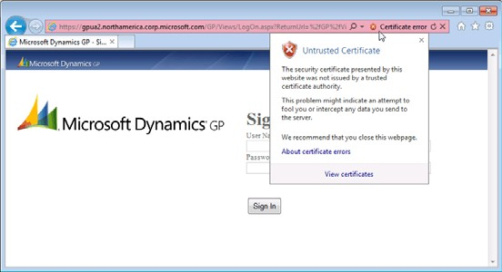

# Importing a Self-signed Security Certificate

When you are using a self-signed security certificate, there is no certificate authority available to verify the certificate. If you use another computer to connect to the [!INCLUDE[prodshort](../includes/prodshort.md)] web client installation that is using a self-signed security certificate, you will see a certificate error displayed in the web browser.

  

If the same self-signed security certificate is used for both the web site and for the web client runtime service, the certificate error can prevent you from successfully logging into the [!INCLUDE[prodshort](../includes/prodshort.md)] web client. The solution is to import the security certificate into the machine that will be accessing the web client. This appendix describes how to do this. First, you must retrieve the security certificate from the server, and then you must install the certificate onto your local machine.

To retrieve the security certificate

1. Open Internet Explorer on the computer that will be used to connect to the [!INCLUDE[prodshort](../includes/prodshort.md)] web client.

2. Connect to the [!INCLUDE[prodshort](../includes/prodshort.md)] web client site. The browser will display a message indicating that there is a problem with the web site’s security certificate. Click Continue to this website.

3. The URL area of the browser you will appear in red, indicating a security certificate error. Click Certificate error to display the details of the error.

  

4. In the drop-down, click View certificates.

5. In the Certificate window, click the Details tab.

6. Click Copy to File to open the Certificate Export Wizard. Click Next.

7. Choose the DER encoded binary X.509 format, and click Next.

8. Click Browse to open a file dialog box that allows you to name the certificate file and select a location for it. A common practice is to name the certificate based on the computer that it is being accessed. In this example, the computer being accessed is named GPUA2, so the certificate is named GPUA2.cer. Choose a convenient location for the file, such as the desktop. Click Save.

9. In the Certificate Export Wizard, click Next. Then click Finish. A message will be displayed indicating that the security certificate was exported.

10. Click OK to close the Certificate window.

To install the security certificate

1. On the computer that will be used to connect to the web client, open the Run prompt. (Choose Start &gt; Run or press Window-R)

2. In the Open field, type MMC and then click OK.

  

3. In the Microsoft Management Console, open the File menu and choose Add/ Remove Snap-in.

4. In the Add or Remove Snap-ins window, choose the Certificates snap-in from the Available snap-ins list, and then click Add.

5. In the Certificates snap-in dialog box, choose Computer account and then click Next.

6. In the Select Computer dialog box, choose Local computer and then click Finish.

7. In the Add or Remove Snap-ins window, click OK.

8. In the left pane, expand the Certificates (Local Computer) node, and then expand the Trusted Root Certification Authorities node.

  

9. In the Microsoft Management Console, open the File menu and choose Add/ Remove Snap-in.

10. In the Add or Remove Snap-ins window, choose the Certificates snap-in from the Available snap-ins list, and then click Add.

11. In the Certificates snap-in dialog box, choose Computer account and then click Next.

12. In the Select Computer dialog box, choose Local computer and then click Finish.

13. In the Add or Remove Snap-ins window, click OK.

148. In the left pane, expand the Certificates (Local Computer) node, and then expand the Trusted Root Certification Authorities node.

  
