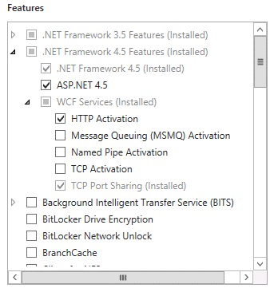

# Prerequisite software

Before you can install the Dynamics GP web components, you must install other software on the web server and the session host servers. The prerequisite software to install will depend on the components you will be installing on the server. The following sections describe these software prerequisites:

-   [Server operating system](#server-operating-system)  

-   [Internet Information Services (IIS) and ASP.NET](#internet-information-services-iis-and-asp.net)  

## Server operating system

To install the Dynamics GP web components, the web server and the session host servers must be running one of the following operating systems:

-   Microsoft Windows Server 2016

-   Microsoft Windows Server 2012

-   Microsoft Windows Server 2012 R2

-   Windows Server 2008 SP1

You cannot install any of the Dynamics GP web client components on a server that is also being used as a domain controller.

## Internet Information Services (IIS) and ASP.NET

Internet Information Services (IIS) and ASP.NET must be installed on the web server on which you will be installing the Dynamics GP web client.

### Windows Server 2008 R2

To install these items, complete the following steps for Windows Server 2008 R2:

1. Open the Server Manager.

2. Click **Roles**.

3. Choose **Add Roles**. In the Add Roles Wizard, click **Next**.

4. Mark **Web Server (IIS)** and then click **Next**.

5. At the Introduction screen, click **Next**.

6. Select the role services to install. The following items must be marked:

In **Common HTTP Features**:

-   Static Content

-   Default Document

In Application Development:

-   ASP.NET

In **Security**:

- **Windows Authentication**

Other role services will already be marked. Some are marked by default. Others are marked depending on how the web server is configured. Click **Next**.

7. Click **Install**. The roles and role services will be added.

8. After the installation is complete, click **Close**.

### Windows Server 2012 and Windows Server 2012 R2 and 2016

To install these items, complete the following steps for Windows Server 2012 and 2016:

1. Open the Server Manager.

2. Click **Manage** &gt;&gt; **Add Roles and Features**.

3. In the Add Roles and Features Wizard, click **Next**.

4. Choose **Role-based or feature-based installation**, and then click **Next**.

5. Select your server from the server pool, and then click **Next**.

6. Mark **Web Server (IIS)** and then click **Next**.

7. Select the features to install. Be sure that you mark **ASP.NET 4.5**. In the **WCF Services** group under .**NET Framework 4.5 Features**, be sure that you have marked **HTTP Activation**.

  

Click **Next**.

8. The screen for the Web Server Role (IIS) is displayed. Click **Next**.

9. Select the role services to install for the web server. The following items must be marked:

In **Common HTTP Features**:

-   Static Content

-   Default Document

In **Security**:

- **Windows Authentication**

In **Application Development**:

- **ASP.NET 4.5**

Other role services will already be marked. Some are marked by default. Others are marked depending on how the web server is configured. Click **Next**.

10. Click **Install**. The roles, features, and role services will be added.

11. After the installation is complete, click **Close**.
