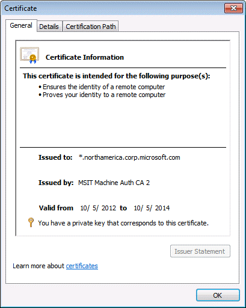
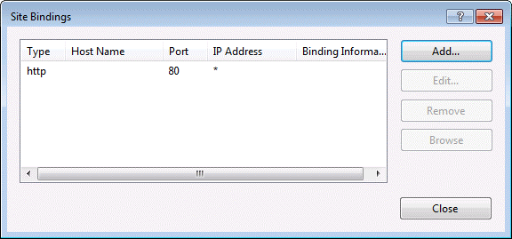
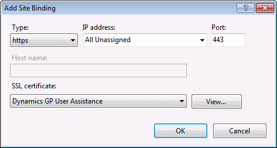
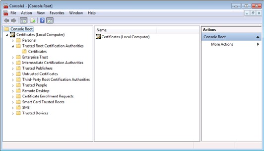

# Security certificates and SSL

Security certificates and secure sockets layer (SSL) are used to help improve the security of the data being transmitted by the [!INCLUDE[prodshort](../includes/prodshort.md)] web components. The web site that hosts the web client and web management console must be configured to use SSL. The GP Service and Web Client runtime service must be configured to use a security certificate. Optionally, the Session Central Service, Session Service and Dex Service Control can be configured to use a security certificate to improve their security in a scale out deployment where cross-machine communication is happening.

Information about security certificates is divided into the following sections:

-   [Security certificate requirements](#security-certificate-requirements)  

-   [Externally signed security certificates](#externally-signed-security-certificates)  

-   [Using an externally signed security certificate for a web site](#using-an-externally-signed-security-certificate-for-a-web-site)  

-   [Self-signed security certificates](#self-signed-security-certificates)  

-   [Configuring the web site to use SSL](#configuring-the-web-site-to-use-ssl)  

-   [Installing a security certificate on a server](#installing-a-security-certificate-on-a-server)  

## Security certificate requirements

The security certificates that you use for your [!INCLUDE[prodshort](../includes/prodshort.md)] web components installation must meet some requirements to work properly.

### Certificate purpose

To be used for the [!INCLUDE[prodshort](../includes/prodshort.md)] web components, the security certificate must have “Server Authentication” listed as one of its intended purposes. You can use the Certificates snap-in for the Microsoft Management Console to view the Intended Purpose column for the certificate.

### Private key

It’s essential that the security certificate that you are using for the runtime service has a private key. This allows the security certificate to be bound to the port that is being used for the runtime service.

To verify that a security certificate has a private key, you can view the details of the certificate file. At the bottom of the details, you should see that the certificate has a private key. If it does not, then the security certificate cannot be used for the runtime service.

  

## Externally signed security certificates

Externally signed security certificates are the easiest way to implement SSL for the [!INCLUDE[prodshort](../includes/prodshort.md)] web components. They must be purchased from the third- party supplier. Due to the additional cost, externally signed security certificates are typically used in a production environments.

There are three basic types of externally signed security certificates:

**Single domain**   This type of security certificate is issued for a specific machine. For example you could get a security certificate issued for the machine with the following name:

-   GPweb.contoso.com.

You would typically use this type of certificate when installing the [!INCLUDE[prodshort](../includes/prodshort.md)] web components in a single machine configuration. This is the least- expensive type of certificate to purchase.

**Multiple domain**   This type of security certificate is issued for a set of specific machines. You must know the machine names at the time that you are purchasing the security certificate. For example, you could get a security certificate issued that could be used for machines with the following names:

- **GPweb.contoso.com**

- **ServiceHost1.contoso.com**

- **ServiceHost2.contoso.com**

- **ServiceHost3.contoso.com**

You would typically use the multiple domain certificate when installing the [!INCLUDE[prodshort](../includes/prodshort.md)] web components in a scale out configuration. The certificate would contain entries for each of the machines that will be part of your web client installation. This security certificate is more expensive, because the same certificate can be used on multiple machines.

## Using an externally signed security certificate for a web site

When an externally signed security certificate is used for a web site, the third-party certificate authority handles the certificate validation when users connect to the web client site. No additional action is needed by the [!INCLUDE[prodshort](../includes/prodshort.md)] web client users.

To use an externally signed security certificate:

1 Obtain the security certificate (.cer or .pfx) file from the third-party certificate supplier.

2 In Administrative Tools on the web server system, open Internet Information Services (IIS) Manager.

3. In the left pane, select the computer name.

4. In the IIS group, open Server Certificates.

  

5. Install the certificate, based on the type of file that has been provided:

-   If your certificate has been provided as a .cer file, complete these actions. In the Actions pane, click **Complete Certificate Request**. Select the certificate (.cer) file that you obtained from the third-party certificate supplier. In the **Friendly name** field, enter the name that will be displayed for the certificate. Click **OK**.

-   If your certificate has been provided a .pfx file, complete these actions. In the Actions pane, click **Import**. Select the certificate (.pfx) file that you obtained from the third-party certificate supplier. Enter the password for the security certificate. Click **OK**.

## Self-signed security certificates

Self-signed security certificates are the least expensive way to implement SSL for the [!INCLUDE[prodshort](../includes/prodshort.md)] web components. You can generate these security certificates from within IIS Manager. They are typically used when you are setting up a [!INCLUDE[prodshort](../includes/prodshort.md)] web components installation for testing or development purposes.

Self-signed security certificates have some limitations. You must use the default subject alternative name (SAN) that is assigned when the security certificate is created. Self-signed security certificates have a limited lifespan, typically one year.

When you use a self-signed security certificate, there is no external authority to handle the certificate validation when users connect to the web client site. Because of this, a certificate error will be displayed when users access the [!INCLUDE[prodshort](../includes/prodshort.md)] web client site. To prevent the certificate error, users must import the security certificate onto their own machine. Refer to [Appendix A, “Importing a Self- signed Security Certificate,”](#_Importing_a_Self-signed_1) for details about importing a self-signed security certificate.  

To use a self-signed security certificate

1. In Administrative Tools on the web server system, open Internet Information Services (IIS) Manager.

2. In the left pane, select the computer name.

3. In the IIS group, open Server Certificates.

4. In the Actions pane, click Create Self-Signed Certificate.

5. Supply the friendly name for the security certificate.

6. Click OK. The security certificate will be created.

## Configuring the web site to use SSL

The web site used for the [!INCLUDE[prodshort](../includes/prodshort.md)] web client must be configured to use SSL. Before configuring the web site, be sure that you have imported an externally signed security certificate or have created a self-signed security certificate.

To configure the web site for SSL

1. In Administrative Tools on the web server system, open Internet Information Services (IIS) Manager.

2. In the left pane, expand the Sites group. Within the Sites group, select the site that you are configuring to use SSL. For example, select the Default Web Site.

3. In the Actions pane, click Bindings.

4. In the Site Binding window, click Add.

  

5. In the Add Site Bindings window, select https for the type, and then choose an SSL certificate that you installed.

  

Click OK.

6. Click Close.

## Installing a security certificate on a server

If you are setting up the scale out configuration for the [!INCLUDE[prodshort](../includes/prodshort.md)] web client installation, the session host machines must have a security certificate that can be used when configuring the runtime session. You will also need to use these steps to install a security certificate in a Service Based Architecture only deployment. If you are using an externally signed security certificate, you will need to install the security certificate onto each session host machine so that the certificate is available to be used.

To install a security certificate

1. On the computer that will be used as a session host, open the Run prompt. (Choose Start &gt; Run or press Window-R)

2. In the Open field, type MMC and then click OK.

  

3. In the Microsoft Management Console, open the File menu and choose Add/ Remove Snap-in.

4. In the Add or Remove Snap-ins window, choose the Certificates snap-in from the Available snap-ins list, and then click Add.

5. In the Certificates snap-in dialog box, choose Computer account and then click Next.

6. In the Select Computer dialog box, choose Local computer and then click Finish.

7. In the Add or Remove Snap-ins window, click OK.

8. In the left pane, expand the Certificates (Local Computer) node, and then expand the Personal node.

  

9. Under Personal, right-click the Certificates node, point to All Tasks, and then click Import.

10. In the Certificate Import Wizard welcome screen, click Next.

11. In the File to Import screen, click Browse.

12. Browse to the location of the security certificate that you want to use. Typically, this will be a file with a .pfx extension, because the certificate contains a private key. Select the file and click Open. Click Next to continue.

13. Enter the password for the certificate. This is the private key password that was either provided with the certificate, or that you defined when you exported the certificate for use on another machine. Be sure that you mark the Include all extended properties box. Click Next to continue.

14. In the Certificate Store screen, verify that the certificate is being added to the Personal store. Click Next.

15. Click Finish to complete the import process.

16. Close the Microsoft Management Console window.
