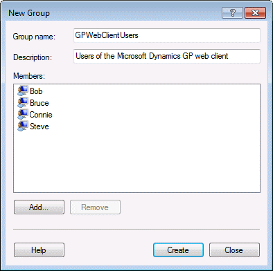

# Security groups and user accounts

To properly secure the [!INCLUDE[prodshort](../includes/prodshort.md)] web components installation, some security groups and specific user accounts are required. Information is divided into the following sections:

-   [Security groups](#security-groups)  

-   [User accounts](#user-accounts)  

## Security groups

Security groups are used to control which users are allowed to access the [!INCLUDE[prodshort](../includes/prodshort.md)] web client and the Web Management Console. These security groups can be machine groups (for the single machine configuration) or domain groups. The domain groups must be security groups, not distribution groups.

  

Typically, you should create one security group for the [!INCLUDE[prodshort](../includes/prodshort.md)] web client, and another security group for the Web Management Console. You can add individual users to these groups. If you have a more complex installation with a large number of users, you may want to create additional groups that you add users to.

## User accounts

Several user accounts are needed to run the web site and services that are part of the [!INCLUDE[prodshort](../includes/prodshort.md)] web components installation. These accounts are typically domain accounts since they will need to access a configuration database on the SQL Server. Ideally, these user accounts should have limited privileges, and a password that does not expire. You may want to use the same account for multiple components of the configuration.

Create the user accounts before you start installing the [!INCLUDE[prodshort](../includes/prodshort.md)] web components. You must have user accounts for the following:

### GP Web Client site application pool

This is the user account that runs the application pool for the web site that hosts the [!INCLUDE[prodshort](../includes/prodshort.md)] web client.

### Web Management Console application pool

This is the user account that runs the application pool for the web site that hosts the

### Web Management Console.

### Session Central Service

This is the user account that runs the Session Central Service. This account must have permissions to read information from Active Directory.

### Session Service

This is the user account that runs the Session Service on each session host machine.

### GP Service

This is the user account that runs the GP Service. This account must have permissions to read information from Active Directory.

### Dexterity Service Control

This is the user account that runs the Dexterity Service Control on each session host machine.
