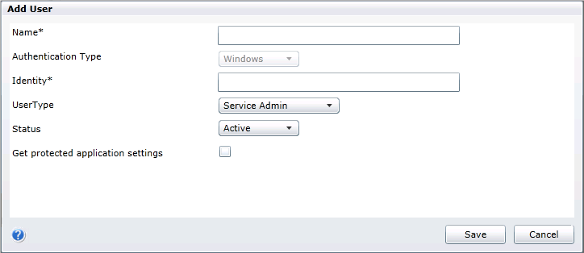
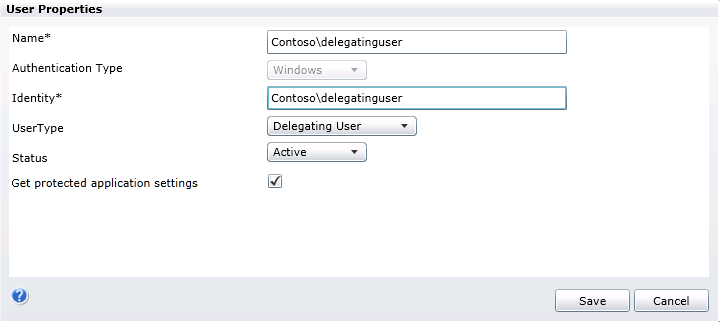
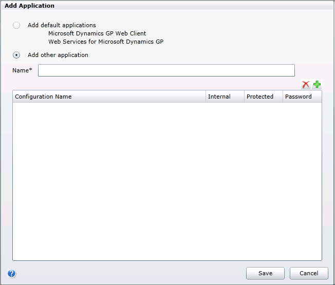
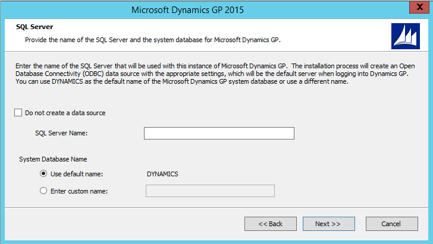
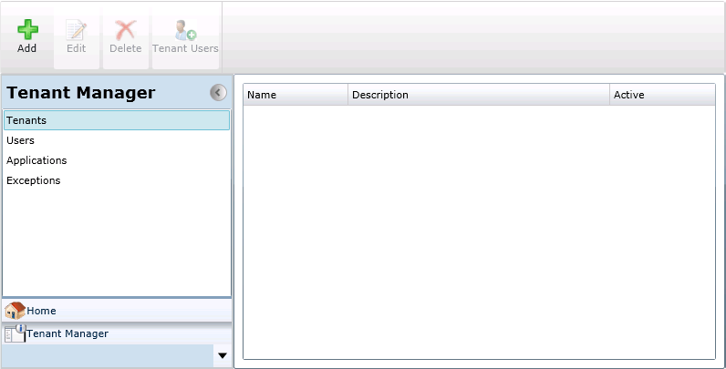
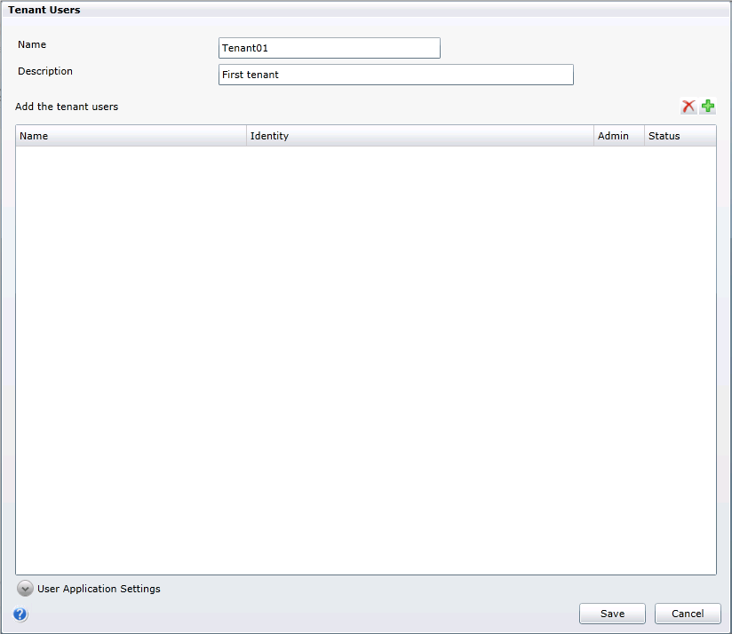
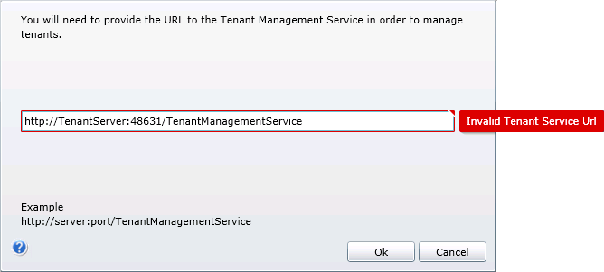
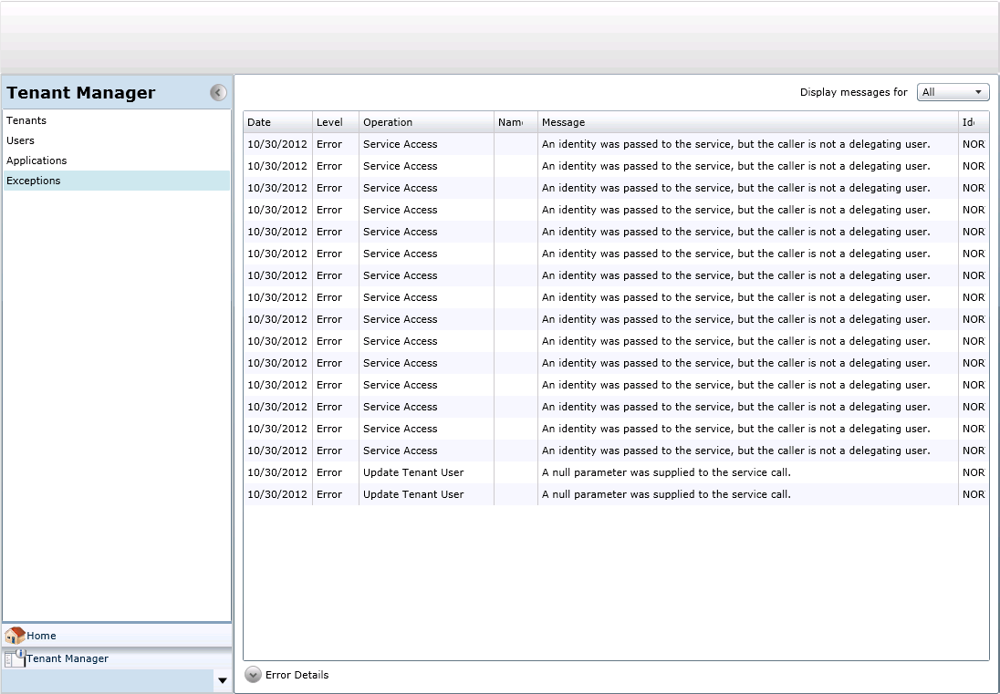

# Tenant Services Configuration and Administration
This portion of the documentation explains the configuration and maintenance
options for Microsoft Dynamics GP Tenant Services. To complete the steps in the
following sections, you have to use the Tenant Manager snap-in of the Microsoft
Dynamics GP Web Management Console. For information about how to install the
Tenant Manager, see Chapter 6, “Tenant Manager Installation.”

The following information is discussed:

• Chapter 7, “Configuring Users,” describes how you add and maintain service
administrator and delegating users.

• Chapter 8, “Configuring Applications,” describes how you add and maintain
multitenant applications in a multitenant environment.

• Chapter 9, “Configuring Tenants,” describes how you add and maintain
tenants.

• Chapter 10, “Maintenance,” describes how to make changes to an existing
Tenant Services installation.

• Chapter 11, “Troubleshooting,” describes how to resolve common issues with
the Tenant Services.

## Chapter 7: Configuring Users
After installing Microsoft Dynamics GP Tenant Services, you can add or update
information about the users you want to administer Tenant Services. To view, add,
update, or remove users, you use the Tenant Manager snap-in of the Web
Management Console. To complete any of the following procedures, you have to
log in to the Tenant Manager snap-in as a service administrator.

The following sections describes how to add, configure, and remove service
administrators and delegating users:

• To add users

• To update a user

• To remove a user

### To add users

The following steps describe how to add a service administrator or delegating user.

1. Open the security group on the tenant server.

    Open Server Manager. Expand Configuration, expand Local Users and Groups,
    and then click Groups. In the list of Groups, find the security group that you
    added for Tenant Services. Double-click the group and the group properties
    window opens.

2. Click Add to add a member to the group.

    To add a member to the group, click Add. You use Select Users, Computers,
    Service Accounts, or Groups to enter the login ID you want to add to the group.
    Click Check Names to validate the ID. Click OK to add the specified user to the
    group.

3. Start the Web Management Console.

    In a browser, open the Web Management Console. To start the Web
    Management Console, you use a URL similar to the following: https://<web
    server name>/WebManagementConsole/

4. Click Tenant Manager.

    You click Tenant Manager to open the snap-in in the Web Management Console.
    Click Users in the navigation pane.

5. Click Add.

    Click Add in the ribbon of the Web Management Console. The Add User
    window opens.

    

    Field | Description
    -|-
    Name | Specify a name for the user.
    Identity | Specify the login ID of the user. You should use the format of domain\alias or alias@domainname.
    User Type | Specify whether the user is a service administrator or a delegating user. A service administrator has access to all tenants, users, and multitenant applications. A delegating user is used to ‘work on behalf’ of another user. The default value is service administrator.
    Status | Specify whether the user is active. Click Inactive if you do not want the specified login to have access to Tenant Services. The default value is Active.
    Get protected application settings | Specify whether application properties that are marked as Protected are retrieved for the user

7. Click Save.

    To add the user, click the Save button.  

### To update a user
The following steps describe how to update an existing service administrator or
delegating user.

1. Start the Web Management Console.

    In a browser, open the Web Management Console. To start the Web
    Management Console, you use a URL similar to the following:
        
        https://<web server name>/WebManagementConsole/

2. Click Tenant Manager.

    You click Tenant Manager to open the snap-in in the Web Management
    Console. Click Users in the navigation pane.

3. Click the user and then click Edit.

    Click the name of the user, and then click Edit in the ribbon of the Web
    Management Console. The User Properties window opens.

    

4. Update the properties for the user.

    The following table shows the information you can update.

    Field | Description
    -|-
    Name | Specify a name for the user.
    Authentication Type  | Specify the authentication type. Typically, you use Windows     authentication.
    Identity | Specify the login ID of the user. You should use the format of domain\username.
    User Type |Specify whether the user is a service administrator or a delegating user. A service administrator has access to all tenants, users, and multitenant applications. A delegating user is used to ‘work on behalf’ of another user.
    Status | Specify whether the user is active. Click Inactive if you do not want the specified login to use tenant services or the Web Management Console. The default value is Active.
    Get protected application settings | Specify whether application properties that are marked as Protected are retrieved for the user. The default value is unmarked.

5. Click Save.

    To update the properties for the user, click the Save button.

### To remove a user
You can remove a service administrator or delegating user from your multitenant
environment.

    Take care when removing delegating users that you do not delete a login that is in use with
    an application pool. If you remove the user, the application pool will no longer be able to use
    any of the tenant services.

The following steps describe how to remove a service administrator or delegating
user.

1. Start the Web Management Console.

    In a browser, open the Web Management Console. To start the Web
    Management Console, you use a URL similar to the following:

        https://<web server name>/WebManagementConsole/

2. Click Tenant Manager.

    Click Tenant Manager to open the snap-in in the Web Management Console. To
    view the available user, click Users in the navigation pane.

3. Click the name of the user.

    The Tenant Manager shows a list of available users. Click the name of the user
    you want to remove.

4. Click Delete.

    Click the Delete button in the tenant manager ribbon of the Web Management
    Console. The user is removed from the list of users.

5. Open the security group on the tenant server.

    Open Server Manager. Expand Configuration, expand Local Users and Groups,
    and then click Groups. In the list of Groups, find the security group that you
    added for Tenant Services. Double-click the group and the group properties
    window opens.

6. Click Remove to delete the member from the group.

    Click the member you want to remove, and then click Remove. Click OK to
    close the group properties window.

## Chapter 8: Configuring Applications
After installing Microsoft Dynamics GP Tenant Services, you can specify the
multitenant applications you want your tenants to use. To add, update, or remove a
multitenant application, use the Tenant Manager snap-in of the Web Management
Console. To complete any of the following procedures, you have to log in to the
Tenant Manager snap-in as a service administrator.

The following sections describes how to add, update, export, import, and remove
multitenant applications:

• To add an application
• To update an application
• To export application information
• To import an application
• To remove an application

### To add an application
You have to specify the application properties for the multitenant application. You
use the application properties to specify the instance of Microsoft Dynamics GP for
a tenant.

1. Start the Web Management Console.

    In a browser, open the Web Management Console. To start the Web
    Management Console, you use a URL similar to the following:

        https://ServerName:PortNumber/WebManagementConsole/

2. Click Tenant Manager.

    Click Tenant Manager to open the snap-in in the Web Management Console.
    Click Applications in the navigation pane.

3. Click Add.

    Click the Add button in the tenant manager ribbon of the Web Management
    Console. The Add Application window opens.

    

4. Specify whether to add the default applications or another application.

    To add the Microsoft Dynamics GP default applications, click Add default
    applications. This enables the following multitenant applications to support
    tenants:

    - GP Services
    - Microsoft Dynamics GP Web Client
    - Web Services for Microsoft Dynamics GP

    To add another multitenant application, click Add other application, and then
    type the name of the application.

5. Add the application properties for the application.

    You have to specify a name for each application property for the specified
    multitenant application.

    If you specified to add the default applications, you do not have to add application
    properties. Continue to the next step.

    Click the Add button. An application property is added. Provide the following
    information.

    Property | Description
    -|-
    Configuration Name | Type the name for the property. The name will appear when you have to configure the multitenant application for a tenant.
    Internal | Specify whether the property is an internal property. The default is to mark the checkbox.
    Protected | Specifies that the property will not be retrieved unless the user account has been configured to display protected properties.
    Password | Specifies that the property is a password value and will be encrypted when it is stored.

6. Click Save.

    To save the application information you added, click Save. The new multitenant
    application appears in the list of applications in the Web Management Console.

### To update an application
The following steps describe how to add or remove an application property for an
existing multitenant application.

1. Start the Web Management Console.

    In a browser, open the Web Management Console. To start the Web
    Management Console, you use a URL similar to the following:

        https://ServerName:PortNumber/WebManagementConsole/

2. Click Tenant Manager.

    You click Tenant Manager to open the snap-in in the Web Management
    Console. Click Applications in the navigation pane.

3. Click Edit.

    Click the Edit button in the ribbon of the Web Management Console. The
    Application Properties window opens.

4. Click the buttons to add or remove application properties.

    To add a new named property, click the Add button and provide the name. You
    should also specify whether the property is an internal setting.

    To remove a property, click the property name in the list of properties and then
    click the Delete button. The property is removed from the list.
    
    Take care when removing application properties. If you remove an application property,
    the multitenant application may no longer run for any tenant. Changes to applications
    should be completed by the person that added the application.

5. Click Save.
    To save the change you made, click Save. The Application Properties window
    closes.

#### To export application information
You can create a file that contains the configuration information for a multitenant
application. You can later import that file on another server to quickly add the
application to a different multitenant environment.

The following steps show how to export an application.

1. Start the Web Management Console.

    In a browser, open the Web Management Console. To start the Web
    Management Console, you use a URL similar to the following:

        https://ServerName:PortNumber/WebManagementConsole/

2. Click Tenant Manager.

    Click Tenant Manager to open the snap-in in the Web Management Console. 
    Click Applications in the navigation pane.

3. Specify the application.

    Click the name of the multitenant application you want to export.

4. Click Export.

    Click the Export button in the Tenant Manager ribbon of the Web Management
    Console. The Application Properties window opens.

5. If you are asked to confirm the export, click OK.

    If you receive a File Download security warning, click OK. The Save As
    window opens.

6. Specify a name and location for the file.

    Use the Save As window to specify a name and location for the file. Be sure to
    leave the file type as .adf.

7. Click Save.

    The Save As window closes and the file appears in the folder that you specified.

#### To import an application
If you have an .adf file that contain configuration information for a multitenant
application, you can import the application to Tenant Services. You have to first put
the .adf file in a folder that is accessible from your Tenant Services machine.

The following steps show how to import a multitenant application.

1. Start the Web Management Console.

    In a browser, open the Web Management Console. To start the Web
    Management Console, you use a URL similar to the following:

        https://ServerName:PortNumber/WebManagementConsole/

2. Click Tenant Manager.

    You click Tenant Manager to open the snap-in in the Web Management
    Console. Click Applications in the navigation pane.

3. Click Import.

    Click the Import button in the ribbon of the Web Management Console. The
    Open window appears.

4. Navigate to the folder that contains your application definition file.

    Click the name of the .adf file that you want to import. Click Open.

5. Verify the application was imported.

    View the list of Applications in the Tenant Manager. The multitenant
    application should appear in that list.

#### To remove an application
You can remove a multitenant application from Tenant Services.
When you remove the multitenant application, the application can no longer be used for any
of the tenants for which the application has been configured. You should not delete a
multitenant application until you confirm that no tenants are using that application.

The following steps describe how to remove a multitenant application.

1. Start the Web Management Console.

In a browser, open the Web Management Console. To start the Web
Management Console, you use a URL similar to the following: 

    https://ServerName:PortNumber/WebManagementConsole/

2. Click Tenant Manager.

    You click Tenant Manager to open the snap-in in the Web Management
    Console. To view the available applications, click Applications in the navigation
    pane.

3. Click the name of the application.

    The Web Management Console shows a list of available multitenant
    applications. Click the name of the application you want to remove.

4. Click Delete.

    Click the Delete button in the tenant manager ribbon of the Web Management
    Console. The multitenant application is removed from the list of applications.

## Chapter 9: Configuring Tenants
After you install Microsoft Dynamics GP Tenant Services, you can add tenants,
tenant users, and the multitenant applications for each tenant. To add, configure, or
remove tenants, you use the Tenant Manager snap-in of the Web Management
Console.

The following sections describes how to add, configure, and remove tenants, tenant
users, and multitenant applications:

- Before you start
- To add a tenant
- To add a tenant user
- To add and configure a tenant application
- To update or remove a tenant
- To update or remove tenant users
- To update or remove tenant applications

### Before you start
Before you add a tenant, you might have to install a new instance of Microsoft
Dynamics GP. To add an instance of Microsoft Dynamics GP, you customize the
name of the instance during the install. You have to provide a unique name for each
instance of Microsoft Dynamics GP in your multitenant environment.

For example, the default name for the first instance of Microsoft Dynamics GP is
GP2013. You can use this instance with the first tenant in your multitenant
environment.

To add an second instance of GP to a multitenant environment, you use the
Microsoft Dynamics GP installer. The following illustration shows the Instance
Selection window from the install. To add a new GP instance to your multitenant
environment, click Create new instance, and then type a name that uniquely
identifies that instance. Notice how the instance name is specified as CONTOSO.

You also have to specify a name for the system database for the new instance. The
following illustration shows how to specify the SQL Server and the name of the
system database for the Contoso instance of GP.

Typically, you use the GP instance name in the application property of an
multitenant application for a tenant. For example, the Microsoft Dynamics GP Web
Client has the DynamicsexeLocation property that specifies the instance for the web
client.

### To add a tenant
This section of the documentation shows how to add a tenant. The sections that
follow show how to add a tenant user and a multitenant application to the tenant.

To add a tenant, you have to log in as a service administrator to the Tenant Manager
snap-in of the Web Management Console.

The following steps describe how to add and configure a tenant.

1. Start the Web Management Console.

    In a browser, open the Web Management Console. To start the Web
    Management Console, you use a URL similar to the following: 

        https://ServerName:PortNumber/WebManagementConsole/

2. Click Tenant Manager.

    Click Tenant Manager in the navigation pane. The snap-in opens in the Web
    Management Console. Click Tenants in the navigation pane.

    

3. Click Add.

    Click Add in the ribbon of the Web Management Console. The Add Tenant
    window opens.

    

4. Specify the tenant properties.

    The following table describes the properties you have to provide:

    Property | Description
    -|-
    Name | Specify the name for the tenant.
    Description | Specify a brief description for the tenant.
    Status | Specify whether the tenant is active or inactive. If the the tenant is inactive, the multitenant application will not be accessible.

5. Click Save.

    To save your tenant, click the Save button. The Add Tenant window closes.

### To add a tenant user
The following steps describe how to add a tenant user to a tenant that you created
earlier. Before you begin, click the tenant name in the list of tenants that appears in
the Tenant Manager snap-in.

1. Click the Tenant Users button.

    Click the Tenant Users button in the ribbon of the Web Management Console.
    The Tenant Users window opens.

    

2. Click the Add button above the Add the tenant users section.

    Click Add (the green plus) to create a new tenant user in the list of tenant users.

3. Populate the properties for the tenant user.
    
    The following table describes the properties you use to add a tenant user:

    Property | Description
    -|-
    Name | Specify a name for the tenant user.
    Identity | Specify the login ID or security group name for the tenant user if the tenant user is a Windows Account. The login ID can use the domainname\alias or alias@domainname format. Use the format that the user will enter when logging in to the multitenant application. Specify the login ID or domain name for the tenant user if the tenant user is an Organizational Account. The login ID will use the alias@domainname format. A domain name will allow any users with a login ID in that domain name access to this tenant. (i.e. *@domainname)
    Admin | Specify whether the tenant user is a tenant administrator. A tenant administrator can use the Tenant Manager snap-in of the Web Management Console to add or remove tenant users.     To add a tenant administrator, mark the checkbox. To give a tenant administrator access to the Web Management Console, you also have to add the login ID for that user to the security     group being used for the Web Management Console. 
    Status | Specify whether the user is active or inactive. An inactive user cannot use the multitenant applications. The default value is Inactive.

    To add more tenant users, click the Add button and repeat this step.

4. Click Save.

    When you have added all the tenant users, click Save.

### To add and configure a tenant application
The following procedures describe how to associate a multitenant application to a
tenant that you added earlier. Before you begin, click the tenant name in the list of
tenants that appears in the Tenant Manager snap-in.

To associate a multitenant application with a tenant, you have to first add the application to
your multitenant environment. To learn more about how to add a multitenant application,
see To add an application on page 57.

#### Select the application
The following steps describe how to associate a multitenant application with a
tenant.

1. Display the list of tenants.

    Click Tenant Manager in the navigation pane of the Web Management Console.
    Click Tenants in the navigation pane, and then select the tenant you want to
    work with.

2. Edit the tenant properties.

    Click the Edit button in the ribbon of the Web Management console. The Tenant
    Properties window opens.

3. View the list of applications.

    The Application Settings section of the Tenant Properties windows shows the
    list of available multitenant applications. By default, none of the applications
    are selected.

    If you install the Microsoft Dynamics GP default applications you will see the
    following list:

    - GP Services
    - Microsoft Dynamics GP Web Client
    - Web Services for Microsoft Dynamics GP

4. Select the application you want to use with the tenant.

    Click the checkbox in the Selection column for the application you want to
    associate with the tenant.

#### Configure the application
The following steps describe how to configure the properties of the multitenant
application that you specified in the previous section.

1. Click the application you want to configure.

    When you click the application, the application properties for that application
    appear in the section below the selection list.
    The following illustration shows the properties for the Microsoft Dynamics GP
    Web Client application.

    

2. Specify the value for each property.

    In the list of properties, specify the configuration value for each property.
    For example, the following table show the properties and configuration values
    for the Microsoft Dynamics GP Web Client. For more information about how to
    install and configure the Web Client application, see Chapter 12, “Configuring
    the Web Client.”
    Name | Value
    -|-
    DynamicsexeLocation | c:\Program Files (x86)\Microsoft Dynamics\GP2015\ 
    DynamicssetLocation | c:\Program Files (x86)\Microsoft Dynamics\GP2015\Dynamics.set
    DexiniLocation | c:\Program Files (x86)\Microsoft Dynamics\GP2015\Data\Dex.ini
    HeartbeatTimeout | 0.20:00:00
    RuntimeLogEnabled | false
    CustomRuntimeSettings | ScriptLogEnabled=false|TimingLogEnabled=false|SqlLogEnabled=false
    SQLUserName | The name for the SQL login that was specified to be used for the web client when the Microsoft Dynamics GP web client runtime was installed.
    SQLPassword | The password for the SQL login being used for the web client.
    RuntimeProcessUserName | The name of the Windows account that the runtime process will run as when a user logs in using an Organizational Account. You only need to provide a value if you are using Organizational Accounts.
    RuntimeProcessPassword | The password for the Windows account used to run the runtime process.

3. Click Save.

 To save the application information for the tenant, click the Save button.

### To update or remove a tenant
This section describes how to make the following types of changes to an existing
tenant:

- Change tenant property values.
- Remove a tenant.

To complete the following procedures, you have to log in to the Tenant Manager
snap-in as a service administrator.

#### Change tenant properties
The following steps describe how to update existing tenant information.

1. Start the Web Management Console.

    In a browser, open the Web Management Console. To start the Web
    Management Console, you use a URL similar to the following:

        https://ServerName:PortNumber/WebManagementConsole/

2. Click Tenant Manager.

    The Tenant Manager snap-in opens in the Web Management Console. Click
    Tenants in the navigation pane.

3. Click the name of the tenant.

    The Tenant Manager snap-in shows a list of available tenants. Click the name of
    the tenant you want to update.

4. Click Edit.

    Click Edit in the ribbon of the Web Management Console. The Tenant
    Properties window opens. You can change the value of the following
    properties:

    Property | Description
    -|-
    Name | Specify the name for the tenant.
    Description | Specify a brief description for the tenant.
    Status | Specify whether the tenant is active or inactive. If the the tenant is inactive, the multitenant application will not be accessible.

#### Remove a tenant
You can remove an existing tenant from a multitenant environment. To remove a
tenant, you have to log in to the Tenant Manager as a service administrator.
The following steps describe how to remove a tenant.

1. Start the Web Management Console.

    In a browser, open the Web Management Console. To start the Web
    Management Console, you use a URL similar to the following:

        https://ServerName:PortNumber/WebManagementConsole/
        
2. Click Tenant Manager.

    You click Tenant Manager to open the snap-in in the Web Management
    Console. To view the available tenants, click Tenants in the navigation pane.

3. Click the name of the tenant.

    The Web Management Console shows a list of available tenants. Click the name
    of the tenant you want to remove.

4. Click Delete.

    Click the Delete button in the tenant manager ribbon of the Web Management
    Console. The tenant is removed from the list of tenants.

### To update or remove tenant users

This section describes how to make the following types of changes to an existing
tenant:

- Change tenant user property values.
- Deactivate or remove a tenant user.

To complete the following procedures, you have to log in to the Tenant Manager
snap-in as a service administrator or a tenant administrator.

#### Change tenant user properties
The following steps describe how you change the status of tenant user.

1. Click the Tenant Users button.

    Click the tenant name in the list of tenants and then click the Tenant Users
    button in the ribbon of the Web Management Console. The Tenant Users
    window opens and lists the tenant users. Select one of the users.

2. Display the user application settings.

    Expand the User Application Settings section of the window to display the
    settings for the selected user.

3. Change the name of the tenant user.

    Click Name and enter the name for the tenant user.

4. Change the identity for the tenant user.

    Click Identity and enter the login name for that tenant user.

5. Change whether the user is tenant administrator.

    Use the Admin checkbox to indicate whether the user is a tenant administrator.
    - Mark the checkbox to make the user a tenant administrator.
    - Clear the checkbox to remove tenant administrator privileges for the user.

6. Change the value in Status drop down list.

    Use the Status value to specify whether an user is active or inactive.
    - To make a tenant user inactive, click the drop down list and select Inactive. The specified user will no longer be able to use the multitenant applications
    for the tenant.
    - To make the tenant user active, click the drop down list and select Active.
    The specified user can now use the multitenant applications associated
    with the tenant.

7. Specify application property values for the tenant user.

    Click the application in the Application Settings list. The properties for the
    specified multitenant application appear. Click the property that you want to
    set for the tenant user and enter a value.

    If you do not specify a property value, the tenant user defaults to the application
    property settings that you specified when you configured the multitenant application
    for the tenant.

    For example, you set the RuntimeLogEnabled property of the Web Client
    application to true. The change enables logging for that tenant user. Activity by
    other tenant users is not recorded in the log file.

8. Click Save.

#### Remove a tenant user
The following steps describe how to remove a tenant user.

1. Click the Tenant Users button.

    Click the tenant name in the list of tenants and then click the Tenant Users
    button in the ribbon of the Web Management Console.

2. Specify the user in the Tenant Users list.

    Click the user name in the Tenant Users list.

3. Click Delete.

    Click the delete button (the red X) above the list of tenant users. The specified
    tenant user is removed from the list. That user will no longer be able to login to
    that tenant.

### To update or remove tenant applications
This section describes how to make the following types of changes to an existing
tenant:

- Add, or remove a multitenant application.
- Update the application properties of an multitenant application.

To complete the following procedures, you have to log in to the Tenant Manager
snap-in as a service administrator.

#### Add or remove an application
The following steps describe how to change the multitenant applications that are
associated with a tenant.

1. Open the Tenant Properties window.

    Click the tenant name in the list of tenants, and then click the Edit button in the
    ribbon of the Web Management Console. The Tenant Properties window opens.

2. View the list of available applications.

    The Application Settings section of the Tenant Properties window shows the list
    of available multitenant applications. Click the application you want to change.

3. Click the application.

    You use the checkbox in the Selection column to add or remove applications for
    the tenant.
    - To add an application, mark the checkbox in the Selection column. After
    you add an application, you must configure the properties for that application.
    - To remove an application, unmark the checkbox in the Selection column.

4. Click Save.

    To save the tenant information, click the Save button of the Tenant Properties
    window.

#### Change application configuration
The following steps describe how to change the application properties for a
multitenant application.

 1. Open the Tenant Properties window.

    Click the tenant name in the list of tenants, and then click the Edit button in the
    ribbon of the Web Management Console. The Tenant Properties window opens.

2. Click the application you want to configure.

    Click the application in the Application Setting list. The properties for that
    application appear as a list below the Application Settings section of the Tenant
    Properties window.

3. Specify a value for each property.

    In the list of properties, click the property you want to change. Enter the value
    to use for the property.

    For example, the following illustration shows how to change the value of the
    Heartbeat Timeout property for the Microsoft Dynamics GP Web Client
    application for the specified tenant. Notice how the other properties keep their
    existing values.

    

4. Click Save.

    To save the changes, click the Save button of the Tenant Properties window.

## Chapter 10: Maintenance
This portion of the documentation provides information about modifying,
repairing, or removing an existing Microsoft Dynamics GP Tenant Services
installation. The following items are discussed:

- Modifying a Tenant Services installation
- Completing a repair
- Removing Tenant Services

### Modifying a Tenant Services installation
Tenant Services allows you to add or remove individual features from an existing
installation. To add or remove features, complete the following steps:

1. Start the Tenant Services installer.

    Open Programs and Features in the Control Panel, right-click Microsoft
    Dynamics GP Tenant Services, and then click Change. The Program
    Maintenance window opens.

2. Choose Add/Remove Features.

    Click Add/Remove Features. The Select Features window opens.

3. Specify the features to add or remove.

    Use the Select Features window to specify the features you want to add or
    remove.

    - To add a feature, click the drop down list and click Run from My Computer.
    - To remove a feature, click the drop down list and click Not Available.

    Click Next.

4. Provide settings for the services.

    You need to provide the configuration setting for each service that is enabled.
    As a result, you might need to specify the configuration settings the Tenant
    Discovery, Tenant Public Discovery, and Tenant Management Services. If you
    previously installed the service, the existing setting values appear in window.
    The services include the following settings:

    Setting | Description
    -|-
    Port | Each service has a default port. If that port is in use, the next available port is selected. In addition, you can enter the port number that you want the service to use.
    Certificate | Specify a security certificate for the service. The security certificate enables the service to use SSL. The default value is Not Selected. A security certificate is optional for the Tenant Discovery Service and the Tenant Management Service. If you do not specify a certificate, SSL will not be used to encrypt messages to and from that service. A security certificate is required for the Tenant Public Discover Service. To review information about available certificates, click the certificate in the drop-down list, and then click the View button. A dialog window opens that provides detailed information about the certificate.
    Host name | The fully-qualified domain name of the server where you have installed the security certificate.
    Domain | Enter the domain name associated with login ID.
    User name | Enter the login ID you want the service to use.
    Password | Enter the password for the specified login ID.
    
    Click Next.

5. Begin the installation.

    Click Install to add or remove the specified features. The installer may take
    several minutes to complete the update.

6. Close the wizard.

    When the Installation Complete window appears, click Exit to close the
    wizard.

    If you added a service, you might need to run the Microsoft Dynamics GP
    Tenant Services Configuration Wizard. You use the wizard to specify the SQL
    Server name, your tenant services database, and the authentication type. For
    more information about how to use the wizard, see Configure the Tenant Services
    database.

### Completing A Repair
If the Microsoft Dynamics GP Tenant Services becomes damaged, the repair
operation may help resolve the issue. The Repair wizard fixes the following:

- Missing or corrupt files
- Missing or corrupt shortcuts
- Missing or corrupt registry entries

To complete a repair, perform the following steps:

1. Start the Tenant Services installer.

    Open Programs and Features, click Microsoft Dynamics GP Tenant Services,
    and then click Change. The Program Maintenance window opens.

2. Click Repair.

3. Provide login credentials for the services.

    You need to provide login information for each service that you installed. As a
    result, you might need to provide the login information for the Tenant
    Discovery, Tenant Public Discovery, and Tenant Management Services. Each
    service requires the following login information.

    Setting | Description
    -|-
    Domain | Enter the domain name associated with login ID you want the service to use. The domain of the existing account appears in the text box. You can keep the existing domain or enter new domain information.
    User name | Specify the login ID you want the service to use. The name of the existing account appears in the text box. You can keep the existing login ID or enter a new login ID.
    Password | Enter the password for the specified login ID.

    Click Next.

4. Ready to repair.

    Click Repair to begin. The repair might run for several minutes.

5. Repair complete

    When the Repair Complete window appears, click Exit to close the wizard.

### Removing Tenant Services
The Tenant Services remove operation allows you to delete all of the installed
tenants services, related folders, and files. It deletes only the files and folders
created in file system of the local machine.

When you remove Tenant Services, the DYNGPDISCOVERY database is not removed. To
remove the database, you have to use SQL Server Management Studio.

To remove Tenant Services from a computer, complete the following steps:

1. Start the Tenant Services installer.

    Open Programs and Features, choose Microsoft Dynamics GP Tenant Services,
    and then click Change. The Program Maintenance window opens.

2. Click Remove.

    Click Remove.

3. Begin the uninstall.

    The Remove window opens. Click Remove to begin the uninstall. The uninstall
    will run for several minutes.

4. Close the wizard.

    When the Remove Complete window appears, click Exit to close the wizard.

## Chapter 11: Troubleshooting
If you encounter problems with Microsoft Dynamics GP Tenant Services, the
following sections may be helpful. They describe some of the most common
situations that can occur when using tenant services. The following items are
discussed:

- Tenant Services do not start
- Error occurs when opening the Web Management Console
- Login problems with the Tenant Manager snap-in
- Tenant Manager requests the service URL
- Error when starting a multitenant application
- View the Tenant Manager exception log
- Check the service configuration files
- Enable error messages to provide additional information
- Enable logging for the Web Client application

### Tenant Services do not start
After you install Tenant Services, you view Services in the Server Manager and find
that the Microsoft Dynamics GP Tenant Discovery Service and the Microsoft
Dynamics GP Tenant Management Service have not started. You attempt to start
both services but neither will run.

The login you used may not have sufficient privileges to initialize the service on the
server. Use Local User and Groups in Server Manager and add the login to the
Administrators group. Try starting each service again. The services should start and
run.

### Error occurs when opening the Web Management Console
You have installed the Microsoft Dynamics GP Web Management Console but you
see the following error when you open the console in Internet Explorer.

    HTTP Error 500.21 -Internal Server Error
    Handler “PageHandlerFactory - Integrated” has a bad module
    “ManagedPipelineHandler” in its module list.

This error can occur when ASP.NET has not been successfully installed on the
server. To correct the specified issue, open a command prompt with administrator
privileges and navigate to the following folder:

    c:\Windows\Microsoft.NET\framework64\v4.0.30319\
T
ype the following command and press enter:

    aspnet_regiis -i

The command installs the specified .NET framework and should eliminate the error
message. After you complete the install, you should run the IIS reset command
(iisreset) to restart the web server.

### Login problems with the Tenant Manager snap-in
After installing Tenant Services, you are unable to open the Tenant Manager in the
Web Management Console. To open the Tenant Manager, you need to be logged in
as a service administrator for Tenant Services.

When you install Tenant Services, your login is added as a service administrator for
Tenant Services. However, you also need to supply a login for the application pool
for the Web Management Console. The specified login is added as a delegating user
for Tenant Services.

A login cannot be both a service administrator and a delegating user. Be sure that
you used a different login for the application pool. If you used the same login for
the application pool identity that you use to install Tenant Service, you might not be
able access the Tenant Manager console.

To use the Tenant Manager in the Web Management Console, be sure that you login
with the ID of the service administrator. Verify that you are logged in with the login
ID you used to install Tenant Services or another ID that is specified as a service
administrator.

### Tenant Manager requests the service URL
When you attempt to open the Tenant Manager in the Web Management Console,
you see the following error message:

Verify the Microsoft Dynamics GP Tenant Management Service is running. You will
not be able to use Tenant Manager until the service is started.

### Error when starting a multitenant application
You start the web client or other multitenant application and receive an unexpected
error.

Verify the Microsoft Dynamics GP Tenant Discovery Service is running. You will
not be able to use the application until the service is running.

If you use the public discovery service to support additional multitenant
applications, you should verify the Microsoft Dynamics GP Tenant Public
Discovery Service is running. The multitenant applications that rely on that service
will not be able to connect to Microsoft Dynamics GP until that service is started.

### View the Tenant Manager exception log
The Tenant Manager of the Microsoft Dynamics GP Web Management Console
includes a list of tenant services exceptions. The following illustration shows the
console.

To view detailed error information, click the error in the list you want to view more
information. Click the Error Details button at the bottom of the page. The Error
Details shows more complete information and additional details about the error.

### Check the service configuration files
The default Microsoft Dynamics GP Tenant Services installation adds two Windows
services to your computer. The installer initially configures each service and stores
the configuration information in an XML file. These XML configuration files contain
elements that have attributes and values that control the operation of the service.

To understand the behavior of a service, you can view the configuration
information in the file. In addition, you can change value to reflect changes in your
environment.

The XML configuration file for the discovery service is named:

    Microsoft.Dynamics.MultitenantServices.Discovery.config

You can find the file in the following location:

    c:\Program Files\Microsoft Dynamics\Tenant Services\DiscoveryService

The management service has an XML configuration file named

    Microsoft.Dynamics.MultitenantServices.Management.config. 

You can find the file in the following location:

    c:\Program Files\Microsoft Dynamics\Tenant Services\ManagementService

The public discovery service has an XML configuration file named
Microsoft.Dynamics.MultitenantServices.Discovery.Public.config. You can find the
file in the following location:

    c:\Program Files\Microsoft Dynamics\Tenant Services\PublicDiscoveryService

Be sure to make a copy of the configuration file before you make any changes to the
file. You can use the saved copy to restore the original configuration settings for the
service.

### Enable error messages to provide additional information
Change the setting in the XML configuration file for the discovery or management
service. You can change the includeExceptionDetailInFaults attribute to the
serviceDebug node to true.

You can use this setting when you are debugging an issue to get the complete error
message. You will see more information about the exception which can help you
identify the cause of the exception.

When you are done, set the value of the includeExceptionDetailInFaults attribute to
false. If you do not restore the original settings, everyone who uses the service will
get the detailed error messages.

You can find includeExceptionDetailInFaults in the following service configuration
files:

- Microsoft.Dynamics.MultitenantServices.Discovery.config
- Microsoft.Dynamics.MultitenantServices.Management.config
- Microsoft.Dynamics.MultitenantServices.Discovery.Public.config

The previous section provides the typical location of each configuration file.

### Enable logging for the Web Client application
The Microsoft Dynamics GP Web Client application includes properties you can use
to enable logging for a tenant or tenant user. You can use the logs to help identify
activity surrounding issues you might encounter while using the Web Client in a
multitenant environment.

You can have the Web Client tenant application produce the following logs:

Name | Description
-|-
Runtime log | The primary log you use to record and view web client activity. The log records information about service calls, client actions, generated macro lines, and Dexterity callbacks.
Script log | Enables the Dexterity script log you can use when you debug sanScript code
Sql log | Enables the same type of logging that you get when you enable SQL logging in the Dex.ini file. The log contains information about the connection to the SQL server and the queries to that server.
Timing log | The log you use to record the timing information for messages, script execution, callbacks, and other events. You enable this log to gather information you can use to monitor performance for an event or action.

To enable logging, the Web Client application includes the following properties:

Property | Description
-|-
RuntimeLogEnabled | This property enables you to create the runtime log for a tenant. The default value for the property is false. To start the Runtime log, set the property to true.
CustomRuntimeSettings | This property enables you to create more detailed log information for scripts, SQL server activity, and the time for specified actions and events. The property includes a parameter for each type of log. The parameters are named ScriptLogEnabled, TimingLogEnabled, and SqlLogEnabled. The default value for the each parameter is false. To start a log, you set the value for that log parameter to true.

You can determine what information goes into a log file by where you enable the
log.

- If you set the property to true in the Application Settings of the Tenant
Properties window, the log contains information for all Web Client users for the
tenant.
- If you set the property to true in the Application Settings section of the Tenant
Users window, the log contains information for the specified tenant user.

After you enable logging, you can find the generated log in the following location:

    %Program Data%\Microsoft Dynamics\GP Sessions\Logs\

When you have completed your analysis, be sure to return the value of the log
properties to false.

## See also

[Tenant Services Basics](tenant-services-basics.md)  
[Multitenant Applications](tenant-services-applications.md)  
[Tenant Services Installation](tenant-services-installation.md)  
