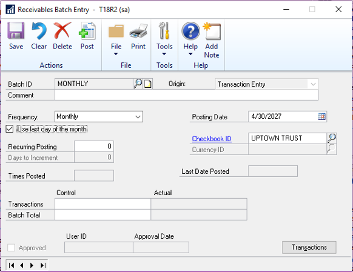
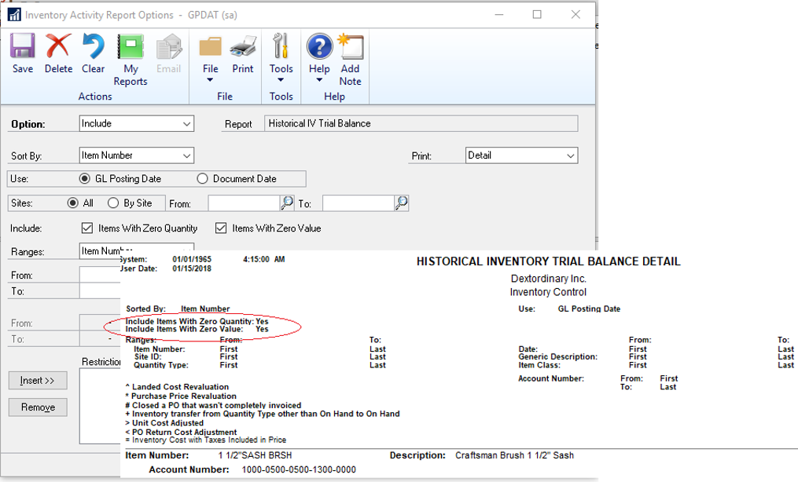
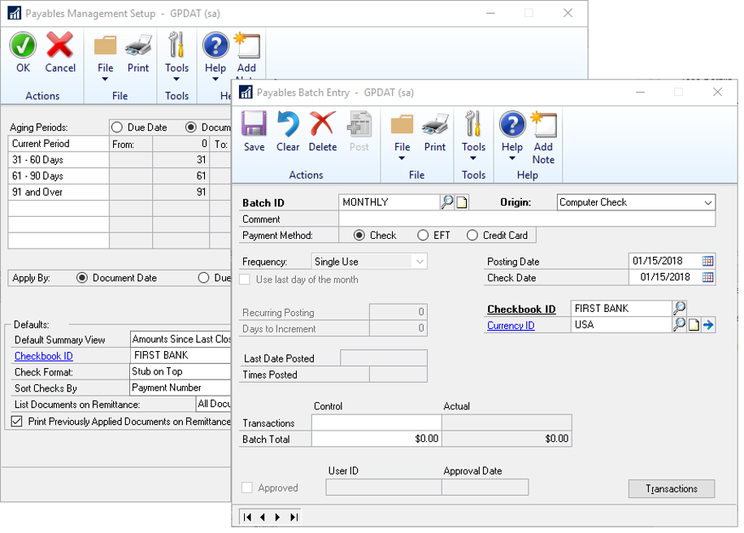
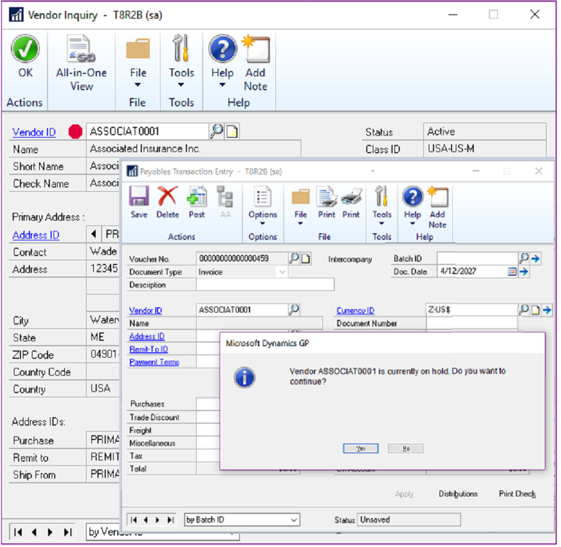

# What’s New in Dynamics GP 2018 R2

This chapter lists enhancements to [!INCLUDE[prodshort](../includes/prodshort.md)] for the Dynamics GP 2018 R2 release. The Dynamics GP 2018 R2 release enhances specific areas of the product.

## Financial enhancements

A number of updates have been made to the finance area in Dynamics GP.

### Monthly recurring batches

With the release of Dynamics GP 2018 R2, users can specify if a monthly or bi-monthly recurring batch must end on the last day of the month in Payables, Receivables, and Inventory Management. When marked, it will automatically set the posting date to the last day of the month. So, if the batch is posted the next posting date would be set to May 31. This is great because before (and without the box checked) it would default the posting date to May 30.  

Three windows have been changed to accommodate the new monthly and bi-monthly recurring batch functionality:

- Receivables Batch Entry
- Payables Batch Entry
- Inventory Batch Entry

Also, a new field,  **Use last day of the month** has been added underneath the **Frequency** field in all three windows. The **Use last day of the month** option is available only when the **Frequency** field has been set to **Monthly** or **Bi-Monthly**. When the **Use last day of the month** option is marked for a monthly recurring batch, the **Posting Date** will be the last day of each month (EOM). When the **Use last day of the month** option is marked for a bi-monthly recurring batch, the **Posting Date** will be the last day of every other month (EOM). 

  

To open these windows, on the Microsoft Dynamics GP menu, point to **Transactions**, choose the relevant area, and then click **Batches**.  

> ![NOTE]
> In earlier versions of Dynamics GP, the next posting date associated with a monthly batch frequency defaulted to 30 days from the previous posting date. Similarly, the next posting date associated with a bi-monthly batch frequency defaults to 60 days from the previous posting date.  

> ![IMPORTANT]
> The first time a user enters transactions associated with a batch marked to **Use the last day of the month**, the **Document Date** field for those transactions will default to the value of the **GP User Date** (shown in the lower left hand corner of Dynamics GP). As such, if users want the document date to match the posting date, they must update the **Document Date** field accordingly in the **Transaction Entry** window. For every recurrence after the first posting, Dynamics GP will automatically update the transaction document dates to match the posting date that is associated with the recurring batch.  

### Exclude items on the HITB report with zero quantity or value

Additional options are added to the **Historical Inventory Trial Balance** report so that you can include items with zero quantity or zero value.  

  

### Transaction level post through G/L

Users can now post through the general ledger at the transaction level in several windows. A new option has been added to **Posting Setup** to allow transactions to post through the general ledger if marked to post through.  

  

### Duplicate check numbers

In the **Checkbook Maintenance** window, you can now allow bank transaction entry, payroll manual checks, and miscellaneous checks.  

  

### Payroll check register FICA totals

The report has employee and employer FICA amounts and a total for both.  

### Start date/end date for pay code  

The **Employee Pay Code Maintenance** window now includes a start date and end date. This is used when building the pay checks to specify if the selected pay codes must be included.  

  

### Shared max for benefit and deduction codes

A new window has been added for the maximum shared amount for benefit and deduction codes. In the **Ded/Ben Shared Limit Setup** window, you can see the YTD max and compare it to calendar year max amount.  

  

## Purchasing

A number of updates have been made to the purchasing area in Dynamics GP.

### Checkbook ID defaults on computer check batch

The Checkbook ID defaults in when you create a computer check batch. Set up the default in the **Payables Management Setup** window.  

  

### Allow partial purchase on a purchase requisition from a purchase order

When you create a purchase order, you can now enter a quantity that is less than the total quantity requested. This is also possible if you create a purchase order from one or more requisitions.  

### Add vendor document number to Purchasing All-in-One View

The vendor's document number now shows in the **Purchasing All-in-One Document View**.  

  

### Send a purchase order using another template

A new option to send a purchase order as an email using the format "Other format" has been added to the purchase order entry and in the Purchase Order Inquiry Zoom.  

### Warning when the vendor is on hold

If you are entering a payables transaction for a vendor that is marked as on hold, you now get a warning.  

  

You can see the vendor hold status in the following pages:

- Vendor Inquiry
- Transactions by Vendor
- Purchasing All-in-One Viewer
- Payables Transaction Entry Zoom

### Don't display Inactive checkbooks in Lookup

## Sales Optimization

Print Invoice in Functional from SOP Navigation List
Sales Transaction Workflow 
Print and email SOP document at the same time
Customer/Combiner retain ship to addresses
Additional Sort options in SOP Item Inquiry 
Email customer statements

## Top Feature Requests

Hide Business Analyzer for all users 
SmartList Designer Favorites display in navigation lists
Mass update inactive from navigation list
Increase Dynamics GP password maximum length
Password expiration notification
Web client with workflow org accounts (June tax release) 
SmartList for Deposits on Unposted Documents 
SmartList Letter Writing Assistant in web client 

